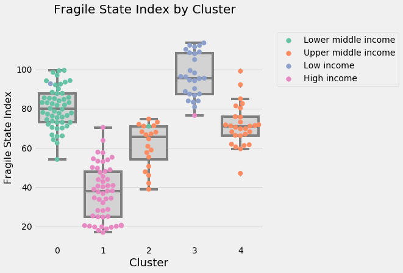
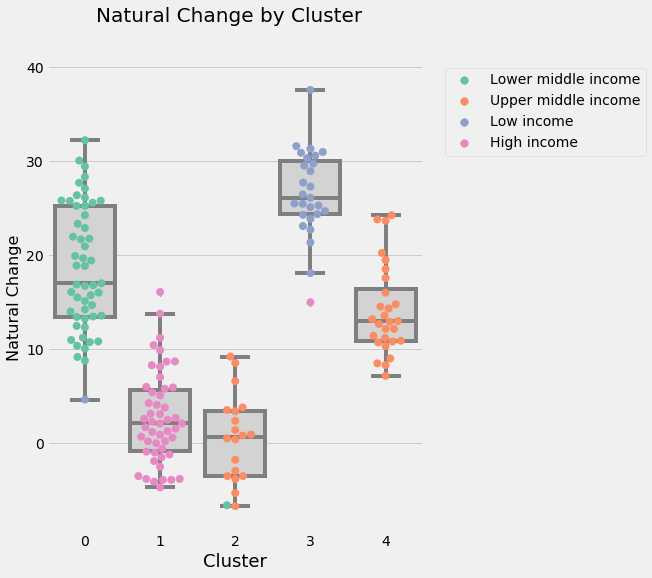

After looking at the visualization [here](/post/places-where-funerals-are-more-common-than-baby-showers), I believe the countries belong to certain categories but I didn't know how to define the profile of those categories. Still using the same data, I try clustering technique utilizing K-means algorithm.

## Data Preparation


```python
import numpy as np
import matplotlib.pyplot as plt
import pandas as pd
import seaborn as sns
import pandas as pd
from kneed import KneeLocator
from sklearn.cluster import KMeans
from sklearn.metrics import silhouette_score
from sklearn.decomposition import PCA
from sklearn.preprocessing import StandardScaler, LabelEncoder, MinMaxScaler
```


```python
#import dataset
df = pd.read_csv('data/Birthrate_Deathrate_fsi_pop_gdp.csv')
df_2019 = df[(df['Region'].notnull()) & (df['Year'] == 2019) & (df['IncomeGroup'].notnull()) & (df['BirthRate'].notnull()) & (df['DeathRate'].notnull()) 
             & (df['Total'].notnull())]
```


```python
#change IncomeGroup to integer and store the encoded IncomeGroup to IncomeGroup_enc
le = LabelEncoder()
df_2019['IncomeGroup_enc'] = le.fit_transform(df_2019['IncomeGroup'])

#adding derived feature
df_2019['NC'] = df_2019['BirthRate']-df_2019['DeathRate']
df_2019.head()
```


<div>
<style scoped>
    .dataframe tbody tr th:only-of-type {
        vertical-align: middle;
    }

    .dataframe tbody tr th {
        vertical-align: top;
    }

    .dataframe thead th {
        text-align: right;
    }
</style>
<table border="1" class="dataframe">
  <thead>
    <tr style="text-align: right;">
      <th></th>
      <th>CountryName</th>
      <th>CountryCode</th>
      <th>Year</th>
      <th>BirthRate</th>
      <th>DeathRate</th>
      <th>CountryName_fsi</th>
      <th>CountryName_wb</th>
      <th>Region</th>
      <th>IncomeGroup</th>
      <th>Country</th>
      <th>...</th>
      <th>P1: State Legitimacy</th>
      <th>P2: Public Services</th>
      <th>P3: Human Rights</th>
      <th>S1: Demographic Pressures</th>
      <th>S2: Refugees and IDPs</th>
      <th>X1: External Intervention</th>
      <th>Population</th>
      <th>GDP</th>
      <th>IncomeGroup_enc</th>
      <th>NC</th>
    </tr>
  </thead>
  <tbody>
    <tr>
      <th>28</th>
      <td>El Salvador</td>
      <td>SLV</td>
      <td>2019</td>
      <td>18.054</td>
      <td>7.070</td>
      <td>El Salvador</td>
      <td>El Salvador</td>
      <td>Latin America &amp; Caribbean</td>
      <td>Lower middle income</td>
      <td>El Salvador</td>
      <td>...</td>
      <td>4.2</td>
      <td>5.8</td>
      <td>5.7</td>
      <td>7.0</td>
      <td>4.8</td>
      <td>5.3</td>
      <td>6453550.0</td>
      <td>2.689666e+10</td>
      <td>2</td>
      <td>10.984</td>
    </tr>
    <tr>
      <th>88</th>
      <td>Equatorial Guinea</td>
      <td>GNQ</td>
      <td>2019</td>
      <td>32.783</td>
      <td>9.112</td>
      <td>Equatorial Guinea</td>
      <td>Equatorial Guinea</td>
      <td>Sub-Saharan Africa</td>
      <td>Upper middle income</td>
      <td>Equatorial Guinea</td>
      <td>...</td>
      <td>9.8</td>
      <td>8.1</td>
      <td>8.6</td>
      <td>7.9</td>
      <td>4.5</td>
      <td>4.4</td>
      <td>1355982.0</td>
      <td>1.141728e+10</td>
      <td>3</td>
      <td>23.671</td>
    </tr>
    <tr>
      <th>148</th>
      <td>Eritrea</td>
      <td>ERI</td>
      <td>2019</td>
      <td>29.738</td>
      <td>7.012</td>
      <td>Eritrea</td>
      <td>Eritrea</td>
      <td>Sub-Saharan Africa</td>
      <td>Low income</td>
      <td>Eritrea</td>
      <td>...</td>
      <td>9.4</td>
      <td>7.8</td>
      <td>8.7</td>
      <td>8.4</td>
      <td>7.7</td>
      <td>7.0</td>
      <td>NaN</td>
      <td>NaN</td>
      <td>1</td>
      <td>22.726</td>
    </tr>
    <tr>
      <th>208</th>
      <td>Estonia</td>
      <td>EST</td>
      <td>2019</td>
      <td>10.600</td>
      <td>11.600</td>
      <td>Estonia</td>
      <td>Estonia</td>
      <td>Europe &amp; Central Asia</td>
      <td>High income</td>
      <td>Estonia</td>
      <td>...</td>
      <td>2.1</td>
      <td>2.3</td>
      <td>1.7</td>
      <td>2.2</td>
      <td>2.5</td>
      <td>3.7</td>
      <td>1326898.0</td>
      <td>3.104559e+10</td>
      <td>0</td>
      <td>-1.000</td>
    </tr>
    <tr>
      <th>268</th>
      <td>Ethiopia</td>
      <td>ETH</td>
      <td>2019</td>
      <td>31.896</td>
      <td>6.418</td>
      <td>Ethiopia</td>
      <td>Ethiopia</td>
      <td>Sub-Saharan Africa</td>
      <td>Low income</td>
      <td>Ethiopia</td>
      <td>...</td>
      <td>8.0</td>
      <td>8.3</td>
      <td>8.2</td>
      <td>9.0</td>
      <td>8.7</td>
      <td>7.9</td>
      <td>112078727.0</td>
      <td>9.591259e+10</td>
      <td>1</td>
      <td>25.478</td>
    </tr>
  </tbody>
</table>
<p>5 rows × 29 columns</p>
</div>


```python
le.fit(df_2019['IncomeGroup'])
le_name_mapping = pd.DataFrame(le.classes_, le.transform(le.classes_))
le_name_mapping['Income Group'] = le_name_mapping.index
le_name_mapping = le_name_mapping.rename(columns={le_name_mapping.columns[0]: "IncomeGroup" })

le_name_mapping
```


<div>
<style scoped>
    .dataframe tbody tr th:only-of-type {
        vertical-align: middle;
    }

    .dataframe tbody tr th {
        vertical-align: top;
    }

    .dataframe thead th {
        text-align: right;
    }
</style>
<table border="1" class="dataframe">
  <thead>
    <tr style="text-align: right;">
      <th></th>
      <th>IncomeGroup</th>
      <th>Income Group</th>
    </tr>
  </thead>
  <tbody>
    <tr>
      <th>0</th>
      <td>High income</td>
      <td>0</td>
    </tr>
    <tr>
      <th>1</th>
      <td>Low income</td>
      <td>1</td>
    </tr>
    <tr>
      <th>2</th>
      <td>Lower middle income</td>
      <td>2</td>
    </tr>
    <tr>
      <th>3</th>
      <td>Upper middle income</td>
      <td>3</td>
    </tr>
  </tbody>
</table>
</div>


Since the analysis is the continuation of the following data storytelling, I want to be consistent with the story so only three measures are analyzed, Natural Change, Fragile State Index(FSI), and Income Group


```python
#select columns for the analysis
df_2019_withname = df_2019[['CountryName','CountryCode','NC','IncomeGroup','IncomeGroup_enc','Total']]
df_clust = df_2019[['NC','IncomeGroup_enc','Total']]
```


```python
cols_scale = df_clust.columns
df_clust.head()
```


<div>
<style scoped>
    .dataframe tbody tr th:only-of-type {
        vertical-align: middle;
    }

    .dataframe tbody tr th {
        vertical-align: top;
    }

    .dataframe thead th {
        text-align: right;
    }
</style>
<table border="1" class="dataframe">
  <thead>
    <tr style="text-align: right;">
      <th></th>
      <th>NC</th>
      <th>IncomeGroup_enc</th>
      <th>Total</th>
    </tr>
  </thead>
  <tbody>
    <tr>
      <th>28</th>
      <td>10.984</td>
      <td>2</td>
      <td>69.8</td>
    </tr>
    <tr>
      <th>88</th>
      <td>23.671</td>
      <td>3</td>
      <td>82.6</td>
    </tr>
    <tr>
      <th>148</th>
      <td>22.726</td>
      <td>1</td>
      <td>96.4</td>
    </tr>
    <tr>
      <th>208</th>
      <td>-1.000</td>
      <td>0</td>
      <td>40.8</td>
    </tr>
    <tr>
      <th>268</th>
      <td>25.478</td>
      <td>1</td>
      <td>94.2</td>
    </tr>
  </tbody>
</table>
</div>


## Clustering Process


```python
#Scaling
scaler = MinMaxScaler().fit(df_clust[cols_scale])
df_clust[cols_scale] = scaler.transform(df_clust[cols_scale]);
df_clust.head()
```


<div>
<style scoped>
    .dataframe tbody tr th:only-of-type {
        vertical-align: middle;
    }

    .dataframe tbody tr th {
        vertical-align: top;
    }

    .dataframe thead th {
        text-align: right;
    }
</style>
<table border="1" class="dataframe">
  <thead>
    <tr style="text-align: right;">
      <th></th>
      <th>NC</th>
      <th>IncomeGroup_enc</th>
      <th>Total</th>
    </tr>
  </thead>
  <tbody>
    <tr>
      <th>28</th>
      <td>0.399151</td>
      <td>0.666667</td>
      <td>0.547619</td>
    </tr>
    <tr>
      <th>88</th>
      <td>0.685514</td>
      <td>1.000000</td>
      <td>0.680124</td>
    </tr>
    <tr>
      <th>148</th>
      <td>0.664184</td>
      <td>0.333333</td>
      <td>0.822981</td>
    </tr>
    <tr>
      <th>208</th>
      <td>0.128657</td>
      <td>0.000000</td>
      <td>0.247412</td>
    </tr>
    <tr>
      <th>268</th>
      <td>0.726300</td>
      <td>0.333333</td>
      <td>0.800207</td>
    </tr>
  </tbody>
</table>
</div>


To determine the number of category, I use charts below and look for the elbow with lowest inertia, then choose the one with the highest silhouette coefficients. The number of cluster chosen will be used in K-means algorithm.


```python
kmeans = KMeans(
    init="random",
    n_clusters=6,
    n_init=10,
    max_iter=300,
    random_state=42
)
kmeans.fit(df_clust)
```


    KMeans(algorithm='auto', copy_x=True, init='random', max_iter=300,
        n_clusters=6, n_init=10, n_jobs=None, precompute_distances='auto',
        random_state=42, tol=0.0001, verbose=0)


```python
kmeans_kwargs = {"init": "k-means++",
                  "n_init": 10,
                  "max_iter": 300,
                  "random_state": 42}
```


```python
   # A list holds the SSE values for each k, to plot in elbow plot
   sse = []
   for k in range(1, 11):
       kmeans = KMeans(n_clusters=k, **kmeans_kwargs)
       kmeans.fit(df_clust)
       sse.append(kmeans.inertia_)
    
# A list holds the silhouette coefficients for each k
silhouette_coefficients = []

# Notice you start at 2 clusters for silhouette coefficient
for k in range(2, 11):
    kmeans = KMeans(n_clusters=k, **kmeans_kwargs)
    kmeans.fit(df_clust)
    score = silhouette_score(df_clust, kmeans.labels_)
    silhouette_coefficients.append(score)
```


```python
fig, axes = plt.subplots(nrows=1, ncols=2, figsize=(15, 7))
fig.tight_layout(pad=7)
axes[0].plot(range(1, 11), sse)
axes[0].set(title='Elbow Plot', xlabel='Number of Clusters', 
       ylabel='Inertia')
axes[1].plot(range(2, 11), silhouette_coefficients)
axes[1].set(title='Silhouette Coefficient', xlabel='Number of Clusters', 
       ylabel='Silhouette Coefficient')
fig.tight_layout()
```


```python
kmeans_1 = KMeans(n_jobs = -1, n_clusters = 5, init='k-means++',random_state=42)
kmeans_1.fit(df_clust)
```


    KMeans(algorithm='auto', copy_x=True, init='k-means++', max_iter=300,
        n_clusters=5, n_init=10, n_jobs=-1, precompute_distances='auto',
        random_state=42, tol=0.0001, verbose=0)


```python
df_2019kmeans_result = df_2019_withname.copy()
df_2019kmeans_result['cluster_ids'] = kmeans_1.labels_
```

## Result


```python
plt.style.use("fivethirtyeight")
plt.figure(figsize=(6, 6))
ax = sns.boxplot(x="cluster_ids", y="Total", data=df_2019kmeans_result, color="lightgrey")
ax = sns.swarmplot(x="cluster_ids", y="Total", data=df_2019kmeans_result, hue="IncomeGroup",palette="Set2",size = 8)

plt.legend(bbox_to_anchor=(1.05, 1), loc=2, borderaxespad=0.2)
plt.suptitle('Fragile State Index by Cluster', fontsize=20)
plt.xlabel('Cluster', fontsize=18)
plt.ylabel('Fragile State Index', fontsize=16)
plt.show()
```





```python
plt.style.use("fivethirtyeight")
plt.figure(figsize=(6, 8))

az = sns.boxplot(x="cluster_ids", y="NC", data=df_2019kmeans_result,color="lightgrey")
az = sns.swarmplot(x="cluster_ids", y="NC", data=df_2019kmeans_result, hue="IncomeGroup", palette="Set2",size = 8)

plt.legend(bbox_to_anchor=(1.05, 1), loc=2, borderaxespad=0.2)
plt.suptitle('Natural Change by Cluster', fontsize=20)
plt.xlabel('Cluster', fontsize=18)
plt.ylabel('Natural Change', fontsize=16)
plt.show()
```





Income category provided by World Bank differentiate countries quite well. Using clusters created by K-means clustering method, the result isn't too far off from World Bank's. The countries are in the same category except for Upper Middle Income. K-means separated Upper Middle Income into two clusters; one with low Natural Change and lower Fragile State Index and one with both higher Natural Change and Fragile State Index. Table below shows the profile of each cluster.


```python
df_clust_Income = pd.DataFrame(df_2019kmeans_result.groupby('cluster_ids')['IncomeGroup_enc'].mean().round(0).astype(int))
#print(df_clust_Income)
#print(le_name_mapping)
df_clust_mapping = pd.merge(df_clust_Income, le_name_mapping, how='left',left_on = 'IncomeGroup_enc',right_on = 'Income Group')
#print(df_clust_mapping)
df_clust_mapping = df_clust_mapping[['IncomeGroup','Income Group']]
df_clust_mapping = df_clust_mapping.T.reset_index()
df_clust_mapping = df_clust_mapping.rename(columns={'index':'Indicator'})
new_col = ['mean', 'Income Group']
df_clust_mapping.insert(loc=1, column='Metric', value=new_col)
```


```python
df_clust_sum1 = df_2019kmeans_result.groupby('cluster_ids').describe().round(2).T.reset_index()
df_clust_sum1 = df_clust_sum1.rename(columns={'level_0':'Indicator','level_1':'Metric'})
df_clust_sum1.loc[df_clust_sum1['Indicator'] == 'NC', 'Indicator'] = 'Natural Change'
df_clust_sum1.loc[df_clust_sum1['Indicator'] == 'Total', 'Indicator'] = 'Fragile State Index'
df_clust_sum1.loc[df_clust_sum1['Indicator'] == 'IncomeGroup_enc', 'Indicator'] = 'Income Group'
df_clust_sum1 = pd.concat([df_clust_sum1, df_clust_mapping], axis=0)
df_clust_sum1
```


<div>
<style scoped>
    .dataframe tbody tr th:only-of-type {
        vertical-align: middle;
    }

    .dataframe tbody tr th {
        vertical-align: top;
    }

    .dataframe thead th {
        text-align: right;
    }
</style>
<table border="1" class="dataframe">
  <thead>
    <tr style="text-align: right;">
      <th>cluster_ids</th>
      <th>Indicator</th>
      <th>Metric</th>
      <th>0</th>
      <th>1</th>
      <th>2</th>
      <th>3</th>
      <th>4</th>
    </tr>
  </thead>
  <tbody>
    <tr>
      <th>0</th>
      <td>Natural Change</td>
      <td>count</td>
      <td>53</td>
      <td>50</td>
      <td>20</td>
      <td>27</td>
      <td>28</td>
    </tr>
    <tr>
      <th>1</th>
      <td>Natural Change</td>
      <td>mean</td>
      <td>18.67</td>
      <td>2.69</td>
      <td>0.37</td>
      <td>26.61</td>
      <td>14.13</td>
    </tr>
    <tr>
      <th>2</th>
      <td>Natural Change</td>
      <td>std</td>
      <td>6.59</td>
      <td>4.86</td>
      <td>4.67</td>
      <td>4.61</td>
      <td>4.74</td>
    </tr>
    <tr>
      <th>3</th>
      <td>Natural Change</td>
      <td>min</td>
      <td>4.64</td>
      <td>-4.7</td>
      <td>-6.7</td>
      <td>15</td>
      <td>7.17</td>
    </tr>
    <tr>
      <th>4</th>
      <td>Natural Change</td>
      <td>25%</td>
      <td>13.48</td>
      <td>-0.83</td>
      <td>-3.5</td>
      <td>24.35</td>
      <td>10.88</td>
    </tr>
    <tr>
      <th>5</th>
      <td>Natural Change</td>
      <td>50%</td>
      <td>17.03</td>
      <td>2.1</td>
      <td>0.66</td>
      <td>26.13</td>
      <td>12.96</td>
    </tr>
    <tr>
      <th>6</th>
      <td>Natural Change</td>
      <td>75%</td>
      <td>25.26</td>
      <td>5.7</td>
      <td>3.43</td>
      <td>30.05</td>
      <td>16.42</td>
    </tr>
    <tr>
      <th>7</th>
      <td>Natural Change</td>
      <td>max</td>
      <td>32.25</td>
      <td>16.09</td>
      <td>9.23</td>
      <td>37.6</td>
      <td>24.26</td>
    </tr>
    <tr>
      <th>8</th>
      <td>Income Group</td>
      <td>count</td>
      <td>53</td>
      <td>50</td>
      <td>20</td>
      <td>27</td>
      <td>28</td>
    </tr>
    <tr>
      <th>9</th>
      <td>Income Group</td>
      <td>mean</td>
      <td>1.98</td>
      <td>0</td>
      <td>2.95</td>
      <td>0.96</td>
      <td>3</td>
    </tr>
    <tr>
      <th>10</th>
      <td>Income Group</td>
      <td>std</td>
      <td>0.14</td>
      <td>0</td>
      <td>0.22</td>
      <td>0.19</td>
      <td>0</td>
    </tr>
    <tr>
      <th>11</th>
      <td>Income Group</td>
      <td>min</td>
      <td>1</td>
      <td>0</td>
      <td>2</td>
      <td>0</td>
      <td>3</td>
    </tr>
    <tr>
      <th>12</th>
      <td>Income Group</td>
      <td>25%</td>
      <td>2</td>
      <td>0</td>
      <td>3</td>
      <td>1</td>
      <td>3</td>
    </tr>
    <tr>
      <th>13</th>
      <td>Income Group</td>
      <td>50%</td>
      <td>2</td>
      <td>0</td>
      <td>3</td>
      <td>1</td>
      <td>3</td>
    </tr>
    <tr>
      <th>14</th>
      <td>Income Group</td>
      <td>75%</td>
      <td>2</td>
      <td>0</td>
      <td>3</td>
      <td>1</td>
      <td>3</td>
    </tr>
    <tr>
      <th>15</th>
      <td>Income Group</td>
      <td>max</td>
      <td>2</td>
      <td>0</td>
      <td>3</td>
      <td>1</td>
      <td>3</td>
    </tr>
    <tr>
      <th>16</th>
      <td>Fragile State Index</td>
      <td>count</td>
      <td>53</td>
      <td>50</td>
      <td>20</td>
      <td>27</td>
      <td>28</td>
    </tr>
    <tr>
      <th>17</th>
      <td>Fragile State Index</td>
      <td>mean</td>
      <td>80.49</td>
      <td>37.15</td>
      <td>61.28</td>
      <td>96.63</td>
      <td>71.44</td>
    </tr>
    <tr>
      <th>18</th>
      <td>Fragile State Index</td>
      <td>std</td>
      <td>10.25</td>
      <td>13.81</td>
      <td>11.12</td>
      <td>11.12</td>
      <td>10.5</td>
    </tr>
    <tr>
      <th>19</th>
      <td>Fragile State Index</td>
      <td>min</td>
      <td>54.1</td>
      <td>16.9</td>
      <td>38.9</td>
      <td>76.5</td>
      <td>47</td>
    </tr>
    <tr>
      <th>20</th>
      <td>Fragile State Index</td>
      <td>25%</td>
      <td>73</td>
      <td>24.85</td>
      <td>54.12</td>
      <td>87.45</td>
      <td>66.35</td>
    </tr>
    <tr>
      <th>21</th>
      <td>Fragile State Index</td>
      <td>50%</td>
      <td>80.1</td>
      <td>37.8</td>
      <td>65.65</td>
      <td>95.5</td>
      <td>70.8</td>
    </tr>
    <tr>
      <th>22</th>
      <td>Fragile State Index</td>
      <td>75%</td>
      <td>87.7</td>
      <td>47.88</td>
      <td>71.03</td>
      <td>108.25</td>
      <td>75.75</td>
    </tr>
    <tr>
      <th>23</th>
      <td>Fragile State Index</td>
      <td>max</td>
      <td>99.5</td>
      <td>70.4</td>
      <td>74.7</td>
      <td>113.5</td>
      <td>99.1</td>
    </tr>
    <tr>
      <th>0</th>
      <td>IncomeGroup</td>
      <td>mean</td>
      <td>Lower middle income</td>
      <td>High income</td>
      <td>Upper middle income</td>
      <td>Low income</td>
      <td>Upper middle income</td>
    </tr>
    <tr>
      <th>1</th>
      <td>Income Group</td>
      <td>Income Group</td>
      <td>2</td>
      <td>0</td>
      <td>3</td>
      <td>1</td>
      <td>3</td>
    </tr>
  </tbody>
</table>
</div>


