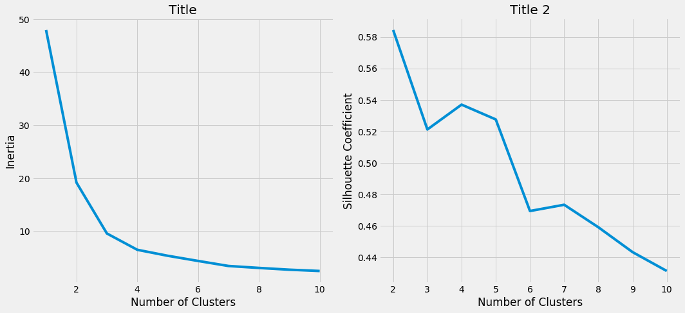
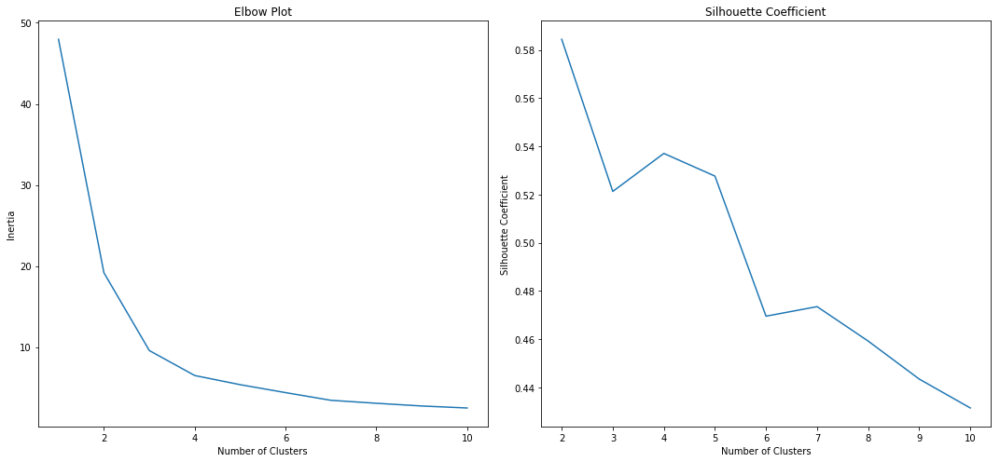
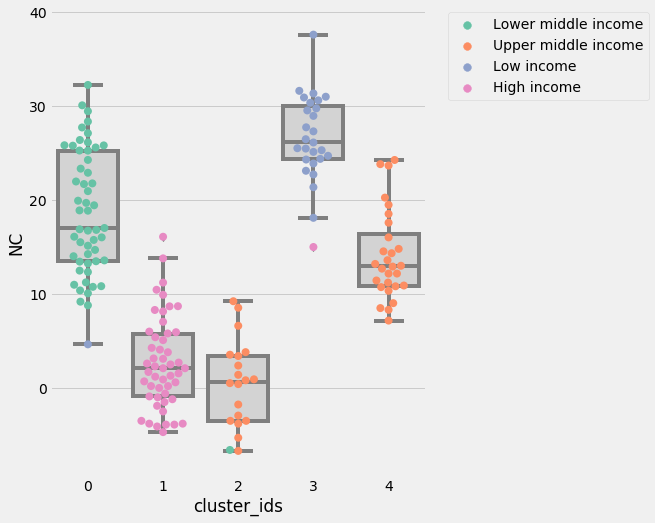

After looking at the visualization here, I believe the countries belong to certain categories but I didn't know how to define the profile of those categories. Still using the same data, I try clustering technique utilizing K-means algorithm.


```python
import numpy as np
import matplotlib.pyplot as plt
import pandas as pd
import seaborn as sns

import pandas as pd
from kneed import KneeLocator
from sklearn.cluster import KMeans
from sklearn.metrics import silhouette_score
from sklearn.decomposition import PCA
from sklearn.preprocessing import StandardScaler, LabelEncoder, MinMaxScaler
```


```python
#import dataset
df = pd.read_csv('data/Birthrate_Deathrate_fsi_pop_gdp.csv')
```


```python
df_2019 = df[(df['Region'].notnull()) & (df['Year'] == 2019) & (df['IncomeGroup'].notnull()) & (df['BirthRate'].notnull()) & (df['DeathRate'].notnull()) 
             & (df['Total'].notnull())]

df_2019.isnull().sum()
```


    CountryName                         0
    CountryCode                         0
    Year                                0
    BirthRate                           0
    DeathRate                           0
    CountryName_fsi                     0
    CountryName_wb                      0
    Region                              0
    IncomeGroup                         0
    Country                             0
    Year_fsi                            0
    Rank                                0
    Total                               0
    C1: Security Apparatus              0
    C2: Factionalized Elites            0
    C3: Group Grievance                 0
    E1: Economy                         0
    E2: Economic Inequality             0
    E3: Human Flight and Brain Drain    0
    P1: State Legitimacy                0
    P2: Public Services                 0
    P3: Human Rights                    0
    S1: Demographic Pressures           0
    S2: Refugees and IDPs               0
    X1: External Intervention           0
    Population                          1
    GDP                                 4
    dtype: int64


```python
#change IncomeGroup to integer and store the encoded IncomeGroup to IncomeGroup_enc

le = LabelEncoder()

df_2019['IncomeGroup_enc'] = le.fit_transform(df_2019['IncomeGroup'])

label_encoder = le.fit_transform(df_2019['IncomeGroup'])

#adding derived feature
df_2019['NC'] = df_2019['BirthRate']-df_2019['DeathRate']
df_2019.head()
```

    C:\Users\Lily\Anaconda3\lib\site-packages\ipykernel_launcher.py:5: SettingWithCopyWarning: 
    A value is trying to be set on a copy of a slice from a DataFrame.
    Try using .loc[row_indexer,col_indexer] = value instead
    
    See the caveats in the documentation: http://pandas.pydata.org/pandas-docs/stable/indexing.html#indexing-view-versus-copy
      """
    C:\Users\Lily\Anaconda3\lib\site-packages\ipykernel_launcher.py:10: SettingWithCopyWarning: 
    A value is trying to be set on a copy of a slice from a DataFrame.
    Try using .loc[row_indexer,col_indexer] = value instead
    
    See the caveats in the documentation: http://pandas.pydata.org/pandas-docs/stable/indexing.html#indexing-view-versus-copy
      # Remove the CWD from sys.path while we load stuff.
    


<div>
<style scoped>
    .dataframe tbody tr th:only-of-type {
        vertical-align: middle;
    }

    .dataframe tbody tr th {
        vertical-align: top;
    }

    .dataframe thead th {
        text-align: right;
    }
</style>
<table border="1" class="dataframe">
  <thead>
    <tr style="text-align: right;">
      <th></th>
      <th>CountryName</th>
      <th>CountryCode</th>
      <th>Year</th>
      <th>BirthRate</th>
      <th>DeathRate</th>
      <th>CountryName_fsi</th>
      <th>CountryName_wb</th>
      <th>Region</th>
      <th>IncomeGroup</th>
      <th>Country</th>
      <th>...</th>
      <th>P1: State Legitimacy</th>
      <th>P2: Public Services</th>
      <th>P3: Human Rights</th>
      <th>S1: Demographic Pressures</th>
      <th>S2: Refugees and IDPs</th>
      <th>X1: External Intervention</th>
      <th>Population</th>
      <th>GDP</th>
      <th>IncomeGroup_enc</th>
      <th>NC</th>
    </tr>
  </thead>
  <tbody>
    <tr>
      <th>28</th>
      <td>El Salvador</td>
      <td>SLV</td>
      <td>2019</td>
      <td>18.054</td>
      <td>7.070</td>
      <td>El Salvador</td>
      <td>El Salvador</td>
      <td>Latin America &amp; Caribbean</td>
      <td>Lower middle income</td>
      <td>El Salvador</td>
      <td>...</td>
      <td>4.2</td>
      <td>5.8</td>
      <td>5.7</td>
      <td>7.0</td>
      <td>4.8</td>
      <td>5.3</td>
      <td>6453550.0</td>
      <td>2.689666e+10</td>
      <td>2</td>
      <td>10.984</td>
    </tr>
    <tr>
      <th>88</th>
      <td>Equatorial Guinea</td>
      <td>GNQ</td>
      <td>2019</td>
      <td>32.783</td>
      <td>9.112</td>
      <td>Equatorial Guinea</td>
      <td>Equatorial Guinea</td>
      <td>Sub-Saharan Africa</td>
      <td>Upper middle income</td>
      <td>Equatorial Guinea</td>
      <td>...</td>
      <td>9.8</td>
      <td>8.1</td>
      <td>8.6</td>
      <td>7.9</td>
      <td>4.5</td>
      <td>4.4</td>
      <td>1355982.0</td>
      <td>1.141728e+10</td>
      <td>3</td>
      <td>23.671</td>
    </tr>
    <tr>
      <th>148</th>
      <td>Eritrea</td>
      <td>ERI</td>
      <td>2019</td>
      <td>29.738</td>
      <td>7.012</td>
      <td>Eritrea</td>
      <td>Eritrea</td>
      <td>Sub-Saharan Africa</td>
      <td>Low income</td>
      <td>Eritrea</td>
      <td>...</td>
      <td>9.4</td>
      <td>7.8</td>
      <td>8.7</td>
      <td>8.4</td>
      <td>7.7</td>
      <td>7.0</td>
      <td>NaN</td>
      <td>NaN</td>
      <td>1</td>
      <td>22.726</td>
    </tr>
    <tr>
      <th>208</th>
      <td>Estonia</td>
      <td>EST</td>
      <td>2019</td>
      <td>10.600</td>
      <td>11.600</td>
      <td>Estonia</td>
      <td>Estonia</td>
      <td>Europe &amp; Central Asia</td>
      <td>High income</td>
      <td>Estonia</td>
      <td>...</td>
      <td>2.1</td>
      <td>2.3</td>
      <td>1.7</td>
      <td>2.2</td>
      <td>2.5</td>
      <td>3.7</td>
      <td>1326898.0</td>
      <td>3.104559e+10</td>
      <td>0</td>
      <td>-1.000</td>
    </tr>
    <tr>
      <th>268</th>
      <td>Ethiopia</td>
      <td>ETH</td>
      <td>2019</td>
      <td>31.896</td>
      <td>6.418</td>
      <td>Ethiopia</td>
      <td>Ethiopia</td>
      <td>Sub-Saharan Africa</td>
      <td>Low income</td>
      <td>Ethiopia</td>
      <td>...</td>
      <td>8.0</td>
      <td>8.3</td>
      <td>8.2</td>
      <td>9.0</td>
      <td>8.7</td>
      <td>7.9</td>
      <td>112078727.0</td>
      <td>9.591259e+10</td>
      <td>1</td>
      <td>25.478</td>
    </tr>
  </tbody>
</table>
<p>5 rows × 29 columns</p>
</div>


```python
#select columns for the analysis
df_2019_withname = df_2019[['CountryName','CountryCode','NC','IncomeGroup','IncomeGroup_enc','Total']]
df_2019_1 = df_2019[['CountryCode','NC','IncomeGroup_enc','Total']]
df_2019_nolabel = df_2019[['NC','IncomeGroup_enc','Total']]

df_2019_nolabel.head()
```


<div>
<style scoped>
    .dataframe tbody tr th:only-of-type {
        vertical-align: middle;
    }

    .dataframe tbody tr th {
        vertical-align: top;
    }

    .dataframe thead th {
        text-align: right;
    }
</style>
<table border="1" class="dataframe">
  <thead>
    <tr style="text-align: right;">
      <th></th>
      <th>NC</th>
      <th>IncomeGroup_enc</th>
      <th>Total</th>
    </tr>
  </thead>
  <tbody>
    <tr>
      <th>28</th>
      <td>10.984</td>
      <td>2</td>
      <td>69.8</td>
    </tr>
    <tr>
      <th>88</th>
      <td>23.671</td>
      <td>3</td>
      <td>82.6</td>
    </tr>
    <tr>
      <th>148</th>
      <td>22.726</td>
      <td>1</td>
      <td>96.4</td>
    </tr>
    <tr>
      <th>208</th>
      <td>-1.000</td>
      <td>0</td>
      <td>40.8</td>
    </tr>
    <tr>
      <th>268</th>
      <td>25.478</td>
      <td>1</td>
      <td>94.2</td>
    </tr>
  </tbody>
</table>
</div>


```python
df_2019_nolabel.isnull().sum()
```


    NC                 0
    IncomeGroup_enc    0
    Total              0
    dtype: int64


```python
# creating a copy to keep original df as is for later
df_clust = df_2019_nolabel.copy()

cols_scale = df_clust.columns
df_clust.head()
```


<div>
<style scoped>
    .dataframe tbody tr th:only-of-type {
        vertical-align: middle;
    }

    .dataframe tbody tr th {
        vertical-align: top;
    }

    .dataframe thead th {
        text-align: right;
    }
</style>
<table border="1" class="dataframe">
  <thead>
    <tr style="text-align: right;">
      <th></th>
      <th>NC</th>
      <th>IncomeGroup_enc</th>
      <th>Total</th>
    </tr>
  </thead>
  <tbody>
    <tr>
      <th>28</th>
      <td>10.984</td>
      <td>2</td>
      <td>69.8</td>
    </tr>
    <tr>
      <th>88</th>
      <td>23.671</td>
      <td>3</td>
      <td>82.6</td>
    </tr>
    <tr>
      <th>148</th>
      <td>22.726</td>
      <td>1</td>
      <td>96.4</td>
    </tr>
    <tr>
      <th>208</th>
      <td>-1.000</td>
      <td>0</td>
      <td>40.8</td>
    </tr>
    <tr>
      <th>268</th>
      <td>25.478</td>
      <td>1</td>
      <td>94.2</td>
    </tr>
  </tbody>
</table>
</div>


```python
#Scaling
scaler = MinMaxScaler().fit(df_clust[cols_scale])
df_clust[cols_scale] = scaler.transform(df_clust[cols_scale]);
```

    C:\Users\Lily\Anaconda3\lib\site-packages\sklearn\preprocessing\data.py:334: DataConversionWarning: Data with input dtype int32, float64 were all converted to float64 by MinMaxScaler.
      return self.partial_fit(X, y)
    

To determine the number of category, I use charts below and look for the knee with lowest inertia, then choose the one with the highest silhouette coefficients. The number of cluster chosen will be used in K-means algorithm.


```python
kmeans = KMeans(
    init="random",
    n_clusters=6,
    n_init=10,
    max_iter=300,
    random_state=42
)

kmeans.fit(df_clust)

kmeans_kwargs = {"init": "k-means++",
                  "n_init": 10,
                  "max_iter": 300,
                  "random_state": 42}
```


```python
   # A list holds the SSE values for each k, to plot in elbow plot
   sse = []
   for k in range(1, 11):
       kmeans = KMeans(n_clusters=k, **kmeans_kwargs)
       kmeans.fit(df_clust)
       sse.append(kmeans.inertia_)
    
# A list holds the silhouette coefficients for each k
silhouette_coefficients = []

# Notice you start at 2 clusters for silhouette coefficient
for k in range(2, 11):
    kmeans = KMeans(n_clusters=k, **kmeans_kwargs)
    kmeans.fit(df_clust)
    score = silhouette_score(df_clust, kmeans.labels_)
    silhouette_coefficients.append(score)
```


```python
fig, axes = plt.subplots(nrows=1, ncols=2, figsize=(15, 7))
fig.tight_layout(pad=7)
axes[0].plot(range(1, 11), sse)
axes[0].set(title='Title', xlabel='Number of Clusters', 
       ylabel='Inertia')
axes[1].plot(range(2, 11), silhouette_coefficients)
axes[1].set(title='Title 2', xlabel='Number of Clusters', 
       ylabel='Silhouette Coefficient')
fig.tight_layout()
```





```python
kmeans_1 = KMeans(n_jobs = -1, n_clusters = 5, init='k-means++',random_state=42)
kmeans_1.fit(df_clust)
```


    KMeans(algorithm='auto', copy_x=True, init='k-means++', max_iter=300,
        n_clusters=5, n_init=10, n_jobs=-1, precompute_distances='auto',
        random_state=42, tol=0.0001, verbose=0)


```python
df_2019kmeans_result = df_2019_withname.copy()

df_2019kmeans_result['cluster_ids'] = kmeans_1.labels_
```


```python
plt.style.use("fivethirtyeight")
plt.figure(figsize=(6, 6))
ax = sns.boxplot(x="cluster_ids", y="Total", data=df_2019kmeans_result, color="lightgrey")
ax = sns.swarmplot(x="cluster_ids", y="Total", data=df_2019kmeans_result, hue="IncomeGroup",palette="Set2",size = 8)

plt.legend(bbox_to_anchor=(1.05, 1), loc=2, borderaxespad=0.2)
plt.suptitle('test title', fontsize=20)
plt.xlabel('Cluster', fontsize=18)
plt.ylabel('Fragile State Index', fontsize=16)
plt.show()
```





```python
plt.style.use("fivethirtyeight")
plt.figure(figsize=(6, 8))

az = sns.boxplot(x="cluster_ids", y="NC", data=df_2019kmeans_result,color="lightgrey")
az = sns.swarmplot(x="cluster_ids", y="NC", data=df_2019kmeans_result, hue="IncomeGroup", palette="Set2",size = 8)

plt.legend(bbox_to_anchor=(1.05, 1), loc=2, borderaxespad=0.2)
plt.show()
```





Income category provided by World Bank differentiate countries quite well. Using clusters created by K-means clustering method, the result isn't too far off from World Bank's. The countries stat in the same category except for Upper Middle Income. K-means separated Upper Middle Income into two clusters; one with low Natural Change and lower Fragile State Index and one with both higher Natural Change and Fragile State Index. Table below shows the profile of each cluster.


```python
# Cluster ID level summary
df_2019kmeans_result.groupby('cluster_ids').describe().T.reset_index()
```


<div>
<style scoped>
    .dataframe tbody tr th:only-of-type {
        vertical-align: middle;
    }

    .dataframe tbody tr th {
        vertical-align: top;
    }

    .dataframe thead th {
        text-align: right;
    }
</style>
<table border="1" class="dataframe">
  <thead>
    <tr style="text-align: right;">
      <th>cluster_ids</th>
      <th>level_0</th>
      <th>level_1</th>
      <th>0</th>
      <th>1</th>
      <th>2</th>
      <th>3</th>
      <th>4</th>
    </tr>
  </thead>
  <tbody>
    <tr>
      <th>0</th>
      <td>NC</td>
      <td>count</td>
      <td>53.000000</td>
      <td>50.000000</td>
      <td>20.000000</td>
      <td>27.000000</td>
      <td>28.000000</td>
    </tr>
    <tr>
      <th>1</th>
      <td>NC</td>
      <td>mean</td>
      <td>18.665528</td>
      <td>2.685760</td>
      <td>0.373450</td>
      <td>26.607111</td>
      <td>14.126750</td>
    </tr>
    <tr>
      <th>2</th>
      <td>NC</td>
      <td>std</td>
      <td>6.590237</td>
      <td>4.859131</td>
      <td>4.670429</td>
      <td>4.606603</td>
      <td>4.737747</td>
    </tr>
    <tr>
      <th>3</th>
      <td>NC</td>
      <td>min</td>
      <td>4.643000</td>
      <td>-4.700000</td>
      <td>-6.700000</td>
      <td>15.000000</td>
      <td>7.172000</td>
    </tr>
    <tr>
      <th>4</th>
      <td>NC</td>
      <td>25%</td>
      <td>13.485000</td>
      <td>-0.825000</td>
      <td>-3.500000</td>
      <td>24.347000</td>
      <td>10.881500</td>
    </tr>
    <tr>
      <th>5</th>
      <td>NC</td>
      <td>50%</td>
      <td>17.026000</td>
      <td>2.100000</td>
      <td>0.665000</td>
      <td>26.126000</td>
      <td>12.962500</td>
    </tr>
    <tr>
      <th>6</th>
      <td>NC</td>
      <td>75%</td>
      <td>25.262000</td>
      <td>5.700000</td>
      <td>3.434500</td>
      <td>30.054500</td>
      <td>16.416500</td>
    </tr>
    <tr>
      <th>7</th>
      <td>NC</td>
      <td>max</td>
      <td>32.251000</td>
      <td>16.091000</td>
      <td>9.229000</td>
      <td>37.604000</td>
      <td>24.264000</td>
    </tr>
    <tr>
      <th>8</th>
      <td>IncomeGroup_enc</td>
      <td>count</td>
      <td>53.000000</td>
      <td>50.000000</td>
      <td>20.000000</td>
      <td>27.000000</td>
      <td>28.000000</td>
    </tr>
    <tr>
      <th>9</th>
      <td>IncomeGroup_enc</td>
      <td>mean</td>
      <td>1.981132</td>
      <td>0.000000</td>
      <td>2.950000</td>
      <td>0.962963</td>
      <td>3.000000</td>
    </tr>
    <tr>
      <th>10</th>
      <td>IncomeGroup_enc</td>
      <td>std</td>
      <td>0.137361</td>
      <td>0.000000</td>
      <td>0.223607</td>
      <td>0.192450</td>
      <td>0.000000</td>
    </tr>
    <tr>
      <th>11</th>
      <td>IncomeGroup_enc</td>
      <td>min</td>
      <td>1.000000</td>
      <td>0.000000</td>
      <td>2.000000</td>
      <td>0.000000</td>
      <td>3.000000</td>
    </tr>
    <tr>
      <th>12</th>
      <td>IncomeGroup_enc</td>
      <td>25%</td>
      <td>2.000000</td>
      <td>0.000000</td>
      <td>3.000000</td>
      <td>1.000000</td>
      <td>3.000000</td>
    </tr>
    <tr>
      <th>13</th>
      <td>IncomeGroup_enc</td>
      <td>50%</td>
      <td>2.000000</td>
      <td>0.000000</td>
      <td>3.000000</td>
      <td>1.000000</td>
      <td>3.000000</td>
    </tr>
    <tr>
      <th>14</th>
      <td>IncomeGroup_enc</td>
      <td>75%</td>
      <td>2.000000</td>
      <td>0.000000</td>
      <td>3.000000</td>
      <td>1.000000</td>
      <td>3.000000</td>
    </tr>
    <tr>
      <th>15</th>
      <td>IncomeGroup_enc</td>
      <td>max</td>
      <td>2.000000</td>
      <td>0.000000</td>
      <td>3.000000</td>
      <td>1.000000</td>
      <td>3.000000</td>
    </tr>
    <tr>
      <th>16</th>
      <td>Total</td>
      <td>count</td>
      <td>53.000000</td>
      <td>50.000000</td>
      <td>20.000000</td>
      <td>27.000000</td>
      <td>28.000000</td>
    </tr>
    <tr>
      <th>17</th>
      <td>Total</td>
      <td>mean</td>
      <td>80.490566</td>
      <td>37.148000</td>
      <td>61.285000</td>
      <td>96.625926</td>
      <td>71.439286</td>
    </tr>
    <tr>
      <th>18</th>
      <td>Total</td>
      <td>std</td>
      <td>10.245360</td>
      <td>13.810470</td>
      <td>11.122252</td>
      <td>11.122278</td>
      <td>10.498866</td>
    </tr>
    <tr>
      <th>19</th>
      <td>Total</td>
      <td>min</td>
      <td>54.100000</td>
      <td>16.900000</td>
      <td>38.900000</td>
      <td>76.500000</td>
      <td>47.000000</td>
    </tr>
    <tr>
      <th>20</th>
      <td>Total</td>
      <td>25%</td>
      <td>73.000000</td>
      <td>24.850000</td>
      <td>54.125000</td>
      <td>87.450000</td>
      <td>66.350000</td>
    </tr>
    <tr>
      <th>21</th>
      <td>Total</td>
      <td>50%</td>
      <td>80.100000</td>
      <td>37.800000</td>
      <td>65.650000</td>
      <td>95.500000</td>
      <td>70.800000</td>
    </tr>
    <tr>
      <th>22</th>
      <td>Total</td>
      <td>75%</td>
      <td>87.700000</td>
      <td>47.875000</td>
      <td>71.025000</td>
      <td>108.250000</td>
      <td>75.750000</td>
    </tr>
    <tr>
      <th>23</th>
      <td>Total</td>
      <td>max</td>
      <td>99.500000</td>
      <td>70.400000</td>
      <td>74.700000</td>
      <td>113.500000</td>
      <td>99.100000</td>
    </tr>
  </tbody>
</table>
</div>


