```python
import numpy as np
import pandas as pd
import matplotlib.pyplot as plt
from datetime import timedelta
import seaborn as sns

from kneed import KneeLocator
from sklearn.cluster import KMeans
from sklearn.metrics import silhouette_score
from sklearn.preprocessing import MinMaxScaler

from lifetimes import BetaGeoFitter, GammaGammaFitter
from lifetimes.utils import \
    summary_data_from_transaction_data

from lifetimes.plotting import \
    plot_frequency_recency_matrix, \
    plot_probability_alive_matrix, \
    plot_period_transactions


import warnings
warnings.filterwarnings("ignore")


#local
path = 'data/'
```


```python
#read all files
customers = pd.read_csv(path+'olist_customers_dataset.csv')
sellers = pd.read_csv(path+'olist_sellers_dataset.csv')
geolocation = pd.read_csv(path+'olist_geolocation_dataset.csv')
products = pd.read_csv(path+'olist_products_dataset.csv')
product_category_name_translation = pd.read_csv(path+'product_category_name_translation.csv')


orders = pd.read_csv(path+'olist_orders_dataset.csv')
order_items = pd.read_csv(path+'olist_order_items_dataset.csv')
order_payments = pd.read_csv(path+'olist_order_payments_dataset.csv')
order_reviews = pd.read_csv(path+'olist_order_reviews_dataset.csv')
```

# What Are We Getting Into Now?

Let's continue the journey by exploring another dataset. The data used in this analysis is provided by [Olist](https://olist.com/pt-br/), an Ecommerce platform company from Brazil. There are multiple leading marketplaces in Brazil and it's a hassle for merchants to connect to each of them. Olist helps these merchants to access huge online customer base through a single platform that integrates various marketplaces. They released this transactional dataset on [Kaggle](https://www.kaggle.com/olistbr/brazilian-ecommerce). The time period of the data is roughly two years, it's quite limited but that doesn't stop us from swimming, diving, and analyzing the dataset.

# Cleaning The Data

For the beginning, I start with Orders. The dataframe consists of 99,441 records spanning from 2016 until 2018. First, I want to focus on getting the full information of orders made by customers so I join Orders, Payment, and Customers, get the ones that have been delivered safely, keep few columns of the newly joined dataframe, and remove null values. We're now set for the analysis.


```python
print(orders.shape)
print('earliest : '+orders['order_purchase_timestamp'].min())
print('latest : '+orders['order_purchase_timestamp'].max())
orders.head()
```

    (99441, 8)
    earliest : 2016-09-04 21:15:19
    latest : 2018-10-17 17:30:18
    


<div>
<style scoped>
    .dataframe tbody tr th:only-of-type {
        vertical-align: middle;
    }

    .dataframe tbody tr th {
        vertical-align: top;
    }

    .dataframe thead th {
        text-align: right;
    }
</style>
<table border="1" class="dataframe">
  <thead>
    <tr style="text-align: right;">
      <th></th>
      <th>order_id</th>
      <th>customer_id</th>
      <th>order_status</th>
      <th>order_purchase_timestamp</th>
      <th>order_approved_at</th>
      <th>order_delivered_carrier_date</th>
      <th>order_delivered_customer_date</th>
      <th>order_estimated_delivery_date</th>
    </tr>
  </thead>
  <tbody>
    <tr>
      <th>0</th>
      <td>e481f51cbdc54678b7cc49136f2d6af7</td>
      <td>9ef432eb6251297304e76186b10a928d</td>
      <td>delivered</td>
      <td>2017-10-02 10:56:33</td>
      <td>2017-10-02 11:07:15</td>
      <td>2017-10-04 19:55:00</td>
      <td>2017-10-10 21:25:13</td>
      <td>2017-10-18 00:00:00</td>
    </tr>
    <tr>
      <th>1</th>
      <td>53cdb2fc8bc7dce0b6741e2150273451</td>
      <td>b0830fb4747a6c6d20dea0b8c802d7ef</td>
      <td>delivered</td>
      <td>2018-07-24 20:41:37</td>
      <td>2018-07-26 03:24:27</td>
      <td>2018-07-26 14:31:00</td>
      <td>2018-08-07 15:27:45</td>
      <td>2018-08-13 00:00:00</td>
    </tr>
    <tr>
      <th>2</th>
      <td>47770eb9100c2d0c44946d9cf07ec65d</td>
      <td>41ce2a54c0b03bf3443c3d931a367089</td>
      <td>delivered</td>
      <td>2018-08-08 08:38:49</td>
      <td>2018-08-08 08:55:23</td>
      <td>2018-08-08 13:50:00</td>
      <td>2018-08-17 18:06:29</td>
      <td>2018-09-04 00:00:00</td>
    </tr>
    <tr>
      <th>3</th>
      <td>949d5b44dbf5de918fe9c16f97b45f8a</td>
      <td>f88197465ea7920adcdbec7375364d82</td>
      <td>delivered</td>
      <td>2017-11-18 19:28:06</td>
      <td>2017-11-18 19:45:59</td>
      <td>2017-11-22 13:39:59</td>
      <td>2017-12-02 00:28:42</td>
      <td>2017-12-15 00:00:00</td>
    </tr>
    <tr>
      <th>4</th>
      <td>ad21c59c0840e6cb83a9ceb5573f8159</td>
      <td>8ab97904e6daea8866dbdbc4fb7aad2c</td>
      <td>delivered</td>
      <td>2018-02-13 21:18:39</td>
      <td>2018-02-13 22:20:29</td>
      <td>2018-02-14 19:46:34</td>
      <td>2018-02-16 18:17:02</td>
      <td>2018-02-26 00:00:00</td>
    </tr>
  </tbody>
</table>
</div>


```python
#change order_purchase_timestamp to date format
orders['order_purchase_timestamp'] = pd.to_datetime(orders['order_purchase_timestamp']).dt.normalize()

#join delivered order with payment with summarized total payment by order id and customer
orders_payment_cust = pd.merge(pd.merge(orders[orders['order_status'] == 'delivered'],order_payments.groupby(['order_id'])['payment_value'].sum().reset_index(name = 'payment_value'),how = "left"),customers,how = 'left')

#select only columns needed for analysis
orders_payment_cust = orders_payment_cust[['order_id','order_purchase_timestamp','payment_value','customer_unique_id']]

#convert object datatype to string
orders_payment_cust['order_id']=orders_payment_cust['order_id'].astype('str')
orders_payment_cust['customer_unique_id']=orders_payment_cust['customer_unique_id'].astype('str')

#remove rows with null values
orders_payment_cust = orders_payment_cust[orders_payment_cust['payment_value'].notnull()]
```

# How Are We Doing?

Customers' transaction is one of the important indicators because It's what keeps Olist's merchants' business going. The number of orders gradually increases in approximately the first half of the chart below. However, on the second half, the number tends to stay at the same place and eventually drops towards the end. In order to increase the transaction volume, the merchants have to acquire new customers or increase number of order and purchase value from existing customers. 

In case you're wondering, yes, the sudden spike in late 2017 is the infamous black friday. Apparently, people fight over electronic devices both [offline](https://www.standard.co.uk/news/world/black-friday-2017-huge-crowds-fight-for-tvs-in-brazil-as-retailers-open-doors-early-across-world-a3700466.html) and [online](https://labsnews.com/en/articles/ecommerce/black-friday-brazil-2018-increase/#:~:text=In%202017%2C%20shoppers%20spent%202.1%20billion%20Brazilian%20Reais%2C%20or%20548%20million%20U.S.%20Dollars*.%C2%A0On%20that%20same%20year%2C%20ecommerce%20stores%20sold%207.9%20more%20times%20than%20on%20a%20regular%20day%2C%20while%20physical%20stores%20saw%20a%20drop%20of%206.1%25%20in%20their%20revenue%20growth%20compared%20to%202016).


```python
plt.style.use("fivethirtyeight")
fig = plt.figure(figsize=(9, 7))
sns.lineplot(data = orders_payment_cust.groupby(['order_purchase_timestamp'])['order_id'].count().reset_index(name = 'num_of_orders'), x="order_purchase_timestamp", y="num_of_orders")
plt.suptitle('Number of Orders Overtime', fontsize=18)
plt.xlabel('Purchase Date', fontsize=14)
plt.ylabel('Number of Orders', fontsize=14);
```


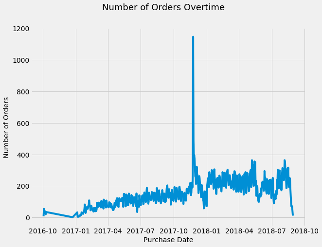


# Get To Know Our Customers

Olist needs to learn about the most valuable buyers. However, the business nature of Ecommerce makes it difficult to determine the active, about to be inactive, and inactive ones. The buying pattern in Ecommerce is random for each customer and there's no service contract(non-contractual) between Olist's merchants and their customers to help determining the status. I'm utilizing lifetime package from Python to find out the most profitable customers, how much revenue they will bring during their lifetime to Olist's merchants (CLV), and prediction of their future purchase behaviour. This knowledge then will be used to craft marketing strategies best-suited for each profile. The profile of profitable existing customers also can be used to acquire new customers with big potential to bring more profit. 

## Recency, Frequency, Monetary

In a non-contractual setting, Recency, Frequency, and Monetary(RFM) is essential to determine the most valuable customers. Lifetime package implements Beta-Geometric/Negative Binomial (BG/NBD) and Gamma-gamma model which predict customer behavior and  measure Customer Lifetime Value (CLV) using RFM data. I have to thank Heiko Onnen for writing [this walkthrough of BG/NBD and Gamma-gamma model](https://towardsdatascience.com/buy-til-you-die-predict-customer-lifetime-value-in-python-9701bfd4ddc0), it really helps me understanding and implementing the concept.


```python
# determine recency, frequency, T, monetary value for each customer
max_date = orders_payment_cust['order_purchase_timestamp'].max() #determine latest date

df_rft = summary_data_from_transaction_data(
    transactions = orders_payment_cust, 
    customer_id_col = 'customer_unique_id', 
    datetime_col = 'order_purchase_timestamp', 
    monetary_value_col = 'payment_value', 
    observation_period_end = max_date, 
    freq = 'D') #set days as time period

pd.options.display.float_format = '{:,.0f}'.format
df_rft.head()
```


<div>
<style scoped>
    .dataframe tbody tr th:only-of-type {
        vertical-align: middle;
    }

    .dataframe tbody tr th {
        vertical-align: top;
    }

    .dataframe thead th {
        text-align: right;
    }
</style>
<table border="1" class="dataframe">
  <thead>
    <tr style="text-align: right;">
      <th></th>
      <th>frequency</th>
      <th>recency</th>
      <th>T</th>
      <th>monetary_value</th>
    </tr>
    <tr>
      <th>customer_unique_id</th>
      <th></th>
      <th></th>
      <th></th>
      <th></th>
    </tr>
  </thead>
  <tbody>
    <tr>
      <th>0000366f3b9a7992bf8c76cfdf3221e2</th>
      <td>0</td>
      <td>0</td>
      <td>111</td>
      <td>0</td>
    </tr>
    <tr>
      <th>0000b849f77a49e4a4ce2b2a4ca5be3f</th>
      <td>0</td>
      <td>0</td>
      <td>114</td>
      <td>0</td>
    </tr>
    <tr>
      <th>0000f46a3911fa3c0805444483337064</th>
      <td>0</td>
      <td>0</td>
      <td>537</td>
      <td>0</td>
    </tr>
    <tr>
      <th>0000f6ccb0745a6a4b88665a16c9f078</th>
      <td>0</td>
      <td>0</td>
      <td>321</td>
      <td>0</td>
    </tr>
    <tr>
      <th>0004aac84e0df4da2b147fca70cf8255</th>
      <td>0</td>
      <td>0</td>
      <td>288</td>
      <td>0</td>
    </tr>
  </tbody>
</table>
</div>


```python
df_rft.describe()
```


<div>
<style scoped>
    .dataframe tbody tr th:only-of-type {
        vertical-align: middle;
    }

    .dataframe tbody tr th {
        vertical-align: top;
    }

    .dataframe thead th {
        text-align: right;
    }
</style>
<table border="1" class="dataframe">
  <thead>
    <tr style="text-align: right;">
      <th></th>
      <th>frequency</th>
      <th>recency</th>
      <th>T</th>
      <th>monetary_value</th>
    </tr>
  </thead>
  <tbody>
    <tr>
      <th>count</th>
      <td>93,357</td>
      <td>93,357</td>
      <td>93,357</td>
      <td>93,357</td>
    </tr>
    <tr>
      <th>mean</th>
      <td>0</td>
      <td>3</td>
      <td>240</td>
      <td>3</td>
    </tr>
    <tr>
      <th>std</th>
      <td>0</td>
      <td>25</td>
      <td>153</td>
      <td>32</td>
    </tr>
    <tr>
      <th>min</th>
      <td>0</td>
      <td>0</td>
      <td>0</td>
      <td>0</td>
    </tr>
    <tr>
      <th>25%</th>
      <td>0</td>
      <td>0</td>
      <td>116</td>
      <td>0</td>
    </tr>
    <tr>
      <th>50%</th>
      <td>0</td>
      <td>0</td>
      <td>221</td>
      <td>0</td>
    </tr>
    <tr>
      <th>75%</th>
      <td>0</td>
      <td>0</td>
      <td>350</td>
      <td>0</td>
    </tr>
    <tr>
      <th>max</th>
      <td>14</td>
      <td>633</td>
      <td>695</td>
      <td>2,405</td>
    </tr>
  </tbody>
</table>
</div>


BG/NBD defines Recency as the number of time periods between a customer’s first and last(latest) transactions, without accounting current date. Recency chart shows a common business situation, Olist's merchants have many one-time purchasers.


```python
fig = plt.figure(figsize=(8, 4)) 
ax = sns.distplot(df_rft["recency"])
ax.set_yscale('log')
ax.set_title("Recency (days): distribution of the customers");
```


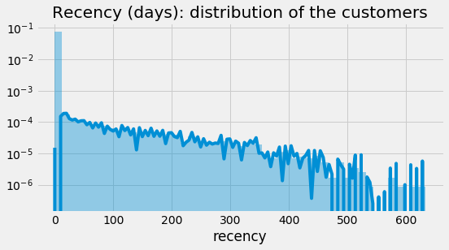


In general, frequency is defined as how many times a customer buys from you, but in BG/NBD model, frequency is the number of time period (in this case study, I'm using days), after the initial purchase. BG/NBD doesn't count a one-time purchase. As expected, the frequency chart is right skewed and most customers are in 0 frequency.


```python
fig = plt.figure(figsize=(8, 4)) 
ax = sns.distplot(df_rft["frequency"])
ax.set_yscale('log')
ax.get_lines()[0].remove()
ax.set_title("Frequency (days): distribution of the customers");
```


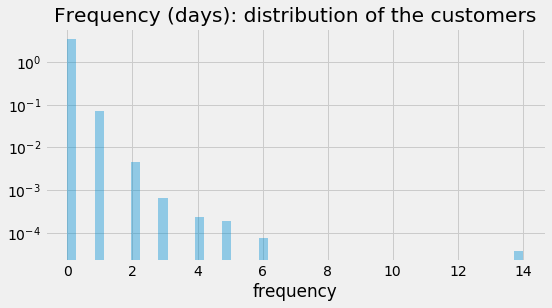


Monetary value is the average amount of money spend by a customer. Again, most customers don't spend a lot.


```python
fig = plt.figure(figsize=(8, 4)) 
ax = sns.distplot(df_rft["monetary_value"])
ax.set_yscale('log')
ax.get_lines()[0].remove()
ax.set_title("Monetary Value (R$) : distribution of the customers");
```


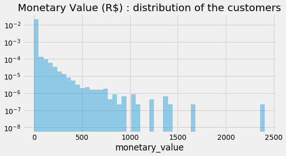


Additionally, we have Customer age/Tenure(T) which is how long a customer stays with our business. It counts the number of time periods since the customer’s first purchase until the determined latest date. Olist's merchants keep acquiring new customers in the first year, but in the second year, they acquire roughly the same amount.


```python
fig = plt.figure(figsize=(8, 4)) 
ax = sns.distplot(df_rft["T"])
ax.set_title("Customer Age T (days): distribution of the customers");
```


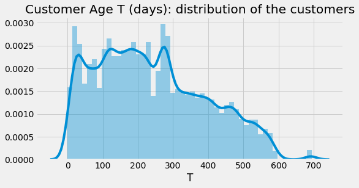


## From RFM To BG/NBD Model

We're done exploring RFM data, it's time to feed it to the BG/NBD model in order to predict purchase behaviour


```python
# BG/NBD model
bgf2 = BetaGeoFitter(penalizer_coef=1e-06)
bgf2.fit(
        frequency = df_rft["frequency"], 
        recency = df_rft["recency"], 
        T = df_rft["T"],   
        weights = None,  
        verbose = True,   
        tol = 1e-06)
pd.options.display.float_format = '{:,.3f}'.format
bgf2.summary
```

    Optimization terminated successfully.
             Current function value: 0.081727
             Iterations: 60
             Function evaluations: 61
             Gradient evaluations: 61
    


<div>
<style scoped>
    .dataframe tbody tr th:only-of-type {
        vertical-align: middle;
    }

    .dataframe tbody tr th {
        vertical-align: top;
    }

    .dataframe thead th {
        text-align: right;
    }
</style>
<table border="1" class="dataframe">
  <thead>
    <tr style="text-align: right;">
      <th></th>
      <th>coef</th>
      <th>se(coef)</th>
      <th>lower 95% bound</th>
      <th>upper 95% bound</th>
    </tr>
  </thead>
  <tbody>
    <tr>
      <th>r</th>
      <td>0.016</td>
      <td>0.001</td>
      <td>0.014</td>
      <td>0.018</td>
    </tr>
    <tr>
      <th>alpha</th>
      <td>68.495</td>
      <td>6.586</td>
      <td>55.586</td>
      <td>81.405</td>
    </tr>
    <tr>
      <th>a</th>
      <td>1.931</td>
      <td>0.448</td>
      <td>1.053</td>
      <td>2.809</td>
    </tr>
    <tr>
      <th>b</th>
      <td>0.336</td>
      <td>0.086</td>
      <td>0.168</td>
      <td>0.504</td>
    </tr>
  </tbody>
</table>
</div>


To check the accuracy of our model, I compare the prediction from BG/NBD model with the actual transaction. The result isn't too far off.


```python
#axis length, get max frequency
max_freq = int(df_rft["frequency"].max())     

# frequency of repeat transactions: predicted vs actual
fig = plt.figure(figsize=(12, 12))
ax = plot_period_transactions(
            model = bgf2,  
            max_frequency = max_freq)
ax.set_yscale('log');
```


    <Figure size 864x864 with 0 Axes>


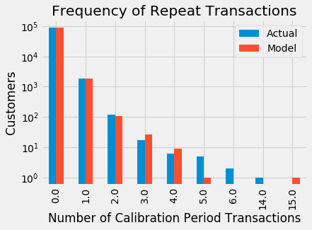


## Purchase Behaviour Prediction

Considering the data is limited, The prediction result from BG/NBD model is quite good, so let's predict some more. I want to see the purchase behaviour for the next 10, 30, 60 , and 90 days for each customer.


```python
# helper function: predict each customer's purchases over next t days
def predict_purch(df, t):
        df["predict_purch_" + str(t)] = \
                bgf2.predict(
                    t, 
                    df["frequency"], 
                    df["recency"], 
                    df["T"])
                    
                    
# call helper function: predict each customer's purchases over multiple time periods
t_FC = [10, 30, 60, 90]
_ = [predict_purch(df_rft, t) for t in t_FC]
pd.options.display.float_format = '{:,.1f}'.format
print("top 10 customers and their purchase behaviour prediction")
df_rft.sort_values(by="predict_purch_30", ascending=False).head()
```

    top 10 customers and their purchase behaviour prediction
    


<div>
<style scoped>
    .dataframe tbody tr th:only-of-type {
        vertical-align: middle;
    }

    .dataframe tbody tr th {
        vertical-align: top;
    }

    .dataframe thead th {
        text-align: right;
    }
</style>
<table border="1" class="dataframe">
  <thead>
    <tr style="text-align: right;">
      <th></th>
      <th>frequency</th>
      <th>recency</th>
      <th>T</th>
      <th>monetary_value</th>
      <th>predict_purch_10</th>
      <th>predict_purch_30</th>
      <th>predict_purch_60</th>
      <th>predict_purch_90</th>
    </tr>
    <tr>
      <th>customer_unique_id</th>
      <th></th>
      <th></th>
      <th></th>
      <th></th>
      <th></th>
      <th></th>
      <th></th>
      <th></th>
    </tr>
  </thead>
  <tbody>
    <tr>
      <th>8d50f5eadf50201ccdcedfb9e2ac8455</th>
      <td>14.0</td>
      <td>428.0</td>
      <td>437.0</td>
      <td>59.1</td>
      <td>0.2</td>
      <td>0.7</td>
      <td>1.3</td>
      <td>1.8</td>
    </tr>
    <tr>
      <th>394ac4de8f3acb14253c177f0e15bc58</th>
      <td>4.0</td>
      <td>236.0</td>
      <td>250.0</td>
      <td>149.3</td>
      <td>0.1</td>
      <td>0.2</td>
      <td>0.4</td>
      <td>0.6</td>
    </tr>
    <tr>
      <th>dc813062e0fc23409cd255f7f53c7074</th>
      <td>5.0</td>
      <td>418.0</td>
      <td>424.0</td>
      <td>151.6</td>
      <td>0.1</td>
      <td>0.2</td>
      <td>0.4</td>
      <td>0.5</td>
    </tr>
    <tr>
      <th>6469f99c1f9dfae7733b25662e7f1782</th>
      <td>5.0</td>
      <td>282.0</td>
      <td>344.0</td>
      <td>133.4</td>
      <td>0.1</td>
      <td>0.2</td>
      <td>0.3</td>
      <td>0.5</td>
    </tr>
    <tr>
      <th>ca77025e7201e3b30c44b472ff346268</th>
      <td>6.0</td>
      <td>235.0</td>
      <td>324.0</td>
      <td>138.9</td>
      <td>0.1</td>
      <td>0.2</td>
      <td>0.3</td>
      <td>0.4</td>
    </tr>
  </tbody>
</table>
</div>


Here's an example on how to read the prediction of the first row from the above table: based on customer 8d50f5eadf50201ccdcedfb9e2ac8455's profile, expect  0.2  purchase(s) over the next 10 days, 0.7 purchase(s) over the next 30 days,  1.3 purchase(s) over the next 60 days, and 1.8 purchase(s) over the next 90 days.

If the purchase prediction is visualized, customers who are most frequent and have high recency are predicted to purchase more.


```python
# helper function: plot expected number of future purchases a customer with 
#    frequency f and recency r will make in forecast period

max_freq = int(df_rft["frequency"].max())        
max_T = int(df_rft["T"].max())                         
max_rec = int(df_rft["recency"].max())  

def plot_freq_rec(t):
    fig = plt.figure(figsize=(12, 8)) 
    plot_frequency_recency_matrix(
            model = bgf2,   
            T = t,  
            max_frequency = max_freq,  
            max_recency = max_rec);
            
            
# call plotter function for different forecast periods:
tFC = [10, 90]
_ = [plot_freq_rec(t) for t in tFC]
```


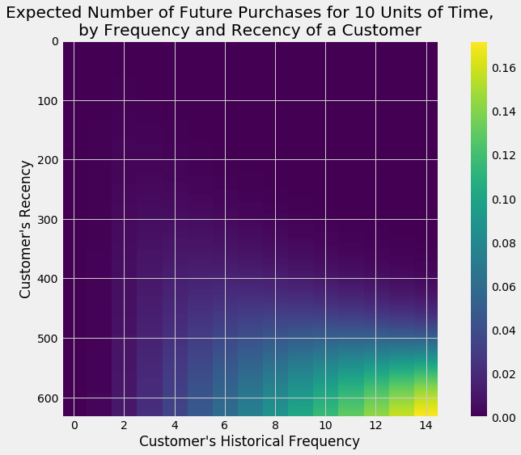


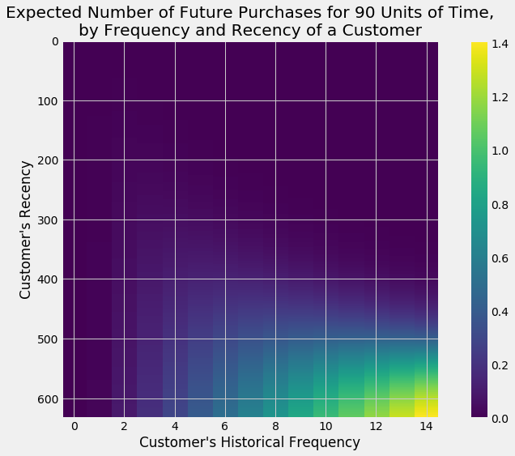


## Probability of Customer Being Alive

As mentioned earlier, in a non-contractual business setting, determining active customers is complicated, but don't worry too much, BG/NBD is here to help us calculating the probability of each customer being active/alive.


```python
# probability that a customer is alive for each customer in dataframe
prob_alive = bgf2.conditional_probability_alive(
        frequency = df_rft["frequency"], 
        recency = df_rft["recency"], 
        T = df_rft["T"])

df_rft["prob_alive"] = prob_alive
pd.options.display.float_format = '{:,.2f}'.format
df_rft.head()
```


<div>
<style scoped>
    .dataframe tbody tr th:only-of-type {
        vertical-align: middle;
    }

    .dataframe tbody tr th {
        vertical-align: top;
    }

    .dataframe thead th {
        text-align: right;
    }
</style>
<table border="1" class="dataframe">
  <thead>
    <tr style="text-align: right;">
      <th></th>
      <th>frequency</th>
      <th>recency</th>
      <th>T</th>
      <th>monetary_value</th>
      <th>predict_purch_10</th>
      <th>predict_purch_30</th>
      <th>predict_purch_60</th>
      <th>predict_purch_90</th>
      <th>prob_alive</th>
    </tr>
    <tr>
      <th>customer_unique_id</th>
      <th></th>
      <th></th>
      <th></th>
      <th></th>
      <th></th>
      <th></th>
      <th></th>
      <th></th>
      <th></th>
    </tr>
  </thead>
  <tbody>
    <tr>
      <th>0000366f3b9a7992bf8c76cfdf3221e2</th>
      <td>0.00</td>
      <td>0.00</td>
      <td>111.00</td>
      <td>0.00</td>
      <td>0.00</td>
      <td>0.00</td>
      <td>0.00</td>
      <td>0.01</td>
      <td>1.00</td>
    </tr>
    <tr>
      <th>0000b849f77a49e4a4ce2b2a4ca5be3f</th>
      <td>0.00</td>
      <td>0.00</td>
      <td>114.00</td>
      <td>0.00</td>
      <td>0.00</td>
      <td>0.00</td>
      <td>0.00</td>
      <td>0.01</td>
      <td>1.00</td>
    </tr>
    <tr>
      <th>0000f46a3911fa3c0805444483337064</th>
      <td>0.00</td>
      <td>0.00</td>
      <td>537.00</td>
      <td>0.00</td>
      <td>0.00</td>
      <td>0.00</td>
      <td>0.00</td>
      <td>0.00</td>
      <td>1.00</td>
    </tr>
    <tr>
      <th>0000f6ccb0745a6a4b88665a16c9f078</th>
      <td>0.00</td>
      <td>0.00</td>
      <td>321.00</td>
      <td>0.00</td>
      <td>0.00</td>
      <td>0.00</td>
      <td>0.00</td>
      <td>0.00</td>
      <td>1.00</td>
    </tr>
    <tr>
      <th>0004aac84e0df4da2b147fca70cf8255</th>
      <td>0.00</td>
      <td>0.00</td>
      <td>288.00</td>
      <td>0.00</td>
      <td>0.00</td>
      <td>0.00</td>
      <td>0.00</td>
      <td>0.00</td>
      <td>1.00</td>
    </tr>
  </tbody>
</table>
</div>


According to the chart, first-time customers and customers who are most frequent with high recency are likely to be alive


```python
# probability that a customer has not churned (= is alive), based on 
# customer's specific recency r and frequency f
fig = plt.figure(figsize=(12, 8))
plot_probability_alive_matrix(
            model = bgf2,  
            max_frequency = max_freq,  
            max_recency = max_rec);
```


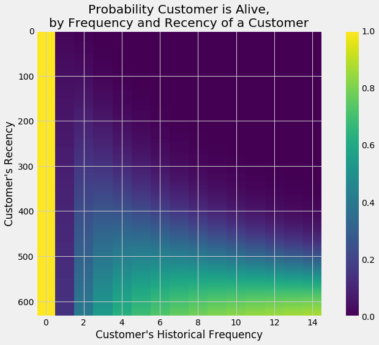


## From RFM To BG/NBD Model To Gamma-Gamma Model

Now we know what the customers are going to do for the next 3 months thanks to BG/NBD. Next, Gamma-Gamma model will help us to find the value of customers. Before continuing, the data needs to be tweaked a little. Gamma-Gamma model only works for positive number, thus the rows with 0 or less monetary values are excluded from the dataset.


```python
# select customers with monetary value > 0 because the model doesn't work with 0 or less values
df_rftv = df_rft[df_rft["monetary_value"] > 0]
pd.options.display.float_format = '{:,.2f}'.format
df_rftv.describe() #check the dataset
```


<div>
<style scoped>
    .dataframe tbody tr th:only-of-type {
        vertical-align: middle;
    }

    .dataframe tbody tr th {
        vertical-align: top;
    }

    .dataframe thead th {
        text-align: right;
    }
</style>
<table border="1" class="dataframe">
  <thead>
    <tr style="text-align: right;">
      <th></th>
      <th>frequency</th>
      <th>recency</th>
      <th>T</th>
      <th>monetary_value</th>
      <th>predict_purch_10</th>
      <th>predict_purch_30</th>
      <th>predict_purch_60</th>
      <th>predict_purch_90</th>
      <th>prob_alive</th>
    </tr>
  </thead>
  <tbody>
    <tr>
      <th>count</th>
      <td>2,015.00</td>
      <td>2,015.00</td>
      <td>2,015.00</td>
      <td>2,015.00</td>
      <td>2,015.00</td>
      <td>2,015.00</td>
      <td>2,015.00</td>
      <td>2,015.00</td>
      <td>2,015.00</td>
    </tr>
    <tr>
      <th>mean</th>
      <td>1.11</td>
      <td>122.55</td>
      <td>313.68</td>
      <td>151.14</td>
      <td>0.00</td>
      <td>0.01</td>
      <td>0.02</td>
      <td>0.03</td>
      <td>0.09</td>
    </tr>
    <tr>
      <th>std</th>
      <td>0.51</td>
      <td>119.53</td>
      <td>146.80</td>
      <td>160.37</td>
      <td>0.01</td>
      <td>0.02</td>
      <td>0.04</td>
      <td>0.06</td>
      <td>0.07</td>
    </tr>
    <tr>
      <th>min</th>
      <td>1.00</td>
      <td>1.00</td>
      <td>7.00</td>
      <td>11.56</td>
      <td>0.00</td>
      <td>0.00</td>
      <td>0.00</td>
      <td>0.00</td>
      <td>0.01</td>
    </tr>
    <tr>
      <th>25%</th>
      <td>1.00</td>
      <td>25.00</td>
      <td>196.50</td>
      <td>62.69</td>
      <td>0.00</td>
      <td>0.00</td>
      <td>0.01</td>
      <td>0.01</td>
      <td>0.05</td>
    </tr>
    <tr>
      <th>50%</th>
      <td>1.00</td>
      <td>81.00</td>
      <td>315.00</td>
      <td>108.30</td>
      <td>0.00</td>
      <td>0.01</td>
      <td>0.01</td>
      <td>0.02</td>
      <td>0.08</td>
    </tr>
    <tr>
      <th>75%</th>
      <td>1.00</td>
      <td>187.50</td>
      <td>432.00</td>
      <td>179.22</td>
      <td>0.00</td>
      <td>0.01</td>
      <td>0.02</td>
      <td>0.03</td>
      <td>0.11</td>
    </tr>
    <tr>
      <th>max</th>
      <td>14.00</td>
      <td>633.00</td>
      <td>695.00</td>
      <td>2,405.28</td>
      <td>0.23</td>
      <td>0.67</td>
      <td>1.27</td>
      <td>1.82</td>
      <td>0.84</td>
    </tr>
  </tbody>
</table>
</div>


There's one more thing to check, in Gamma-Gamma model, the frequency of purchases needs to be independent from their monetary value and to measure this, we use Pearson correlation. The result is close to 0 so the data passes the requirement.


```python
# Gamma-Gamma model requires a Pearson correlation close to 0 
# between purchase frequency and monetary value

corr_matrix = df_rftv[["monetary_value", "frequency"]].corr()
corr = corr_matrix.iloc[1,0]
print("Pearson correlation: %.3f" % corr)
```

    Pearson correlation: 0.002
    

After some preparations, the dataset is ready to be fed to Gamma-Gamma model.


```python
# fitting the Gamma-Gamma model
ggf = GammaGammaFitter(penalizer_coef = 1e-06)
ggf.fit(
        frequency = df_rftv["frequency"],
        monetary_value = df_rftv["monetary_value"],  
        weights = None,   
        verbose = True,  
        tol = 1e-06,  
        q_constraint = True)
pd.options.display.float_format = '{:,.3f}'.format
ggf.summary
```


<div>
<style scoped>
    .dataframe tbody tr th:only-of-type {
        vertical-align: middle;
    }

    .dataframe tbody tr th {
        vertical-align: top;
    }

    .dataframe thead th {
        text-align: right;
    }
</style>
<table border="1" class="dataframe">
  <thead>
    <tr style="text-align: right;">
      <th></th>
      <th>coef</th>
      <th>se(coef)</th>
      <th>lower 95% bound</th>
      <th>upper 95% bound</th>
    </tr>
  </thead>
  <tbody>
    <tr>
      <th>p</th>
      <td>7.016</td>
      <td>0.930</td>
      <td>5.193</td>
      <td>8.840</td>
    </tr>
    <tr>
      <th>q</th>
      <td>2.636</td>
      <td>0.141</td>
      <td>2.360</td>
      <td>2.911</td>
    </tr>
    <tr>
      <th>v</th>
      <td>36.073</td>
      <td>6.913</td>
      <td>22.523</td>
      <td>49.624</td>
    </tr>
  </tbody>
</table>
</div>


## Customer Lifetime Value(CLV)

To calculate Customer Lifetime Value, Gamma-Gamma model needs three more parameters. The first one is lifetime which means the time period since customer's first purchase until the unknown churn date. The model sets all customers with the same lifetime, so we only need to define a time period. In this case, I want to see CLV for each customer over the next 12 months. The second parameter is discount. This one is a little more complicated. It involves time-value-of-money concept([money in the present is worth more than the same sum of money to be received in the future](https://corporatefinanceinstitute.com/resources/knowledge/valuation/time-value-of-money/)) and company's [cost of capital](https://corporatefinanceinstitute.com/resources/knowledge/finance/cost-of-capital/). To simplify this, I choose 12% because it's [in the range of decent amount of discount rate](https://mercercapital.com/article/understand-the-discount-rate-used-in-a-business-valuation/#:~:text=An%20equity%20discount%20rate%20range%20of%2012%25%20to%2020%25%2C%20give%20or%20take%2C%20is%20likely%20to%20be%20considered%20reasonable%20in%20a%20business%20valuation). The last parameter is BG/NBD model that is defined earlier, thus Gamma-Gamma is tied to BG/NBD.


```python
# compute customer lifetime value
DISCOUNT_a = 0.12                # annual discount rate
LIFE = 12                        # lifetime expected for the customers in months

discount_m = (1 + DISCOUNT_a)**(1/12) - 1     # monthly discount rate

clv = ggf.customer_lifetime_value(
        transaction_prediction_model = bgf2,  
        frequency = df_rftv["frequency"],  
        recency = df_rftv["recency"],  
        T = df_rftv["T"],  
        monetary_value = df_rftv["monetary_value"],  
        time = LIFE,    
        freq = "D",                          
        discount_rate = discount_m)

df_rftv.insert(0, "CLV", clv)             # expected customer lifetime values
pd.options.display.float_format = '{:,.2f}'.format
df_rftv.describe().T
```


<div>
<style scoped>
    .dataframe tbody tr th:only-of-type {
        vertical-align: middle;
    }

    .dataframe tbody tr th {
        vertical-align: top;
    }

    .dataframe thead th {
        text-align: right;
    }
</style>
<table border="1" class="dataframe">
  <thead>
    <tr style="text-align: right;">
      <th></th>
      <th>count</th>
      <th>mean</th>
      <th>std</th>
      <th>min</th>
      <th>25%</th>
      <th>50%</th>
      <th>75%</th>
      <th>max</th>
    </tr>
  </thead>
  <tbody>
    <tr>
      <th>CLV</th>
      <td>2,015.00</td>
      <td>11.45</td>
      <td>22.81</td>
      <td>0.34</td>
      <td>3.15</td>
      <td>5.99</td>
      <td>11.17</td>
      <td>356.00</td>
    </tr>
    <tr>
      <th>frequency</th>
      <td>2,015.00</td>
      <td>1.11</td>
      <td>0.51</td>
      <td>1.00</td>
      <td>1.00</td>
      <td>1.00</td>
      <td>1.00</td>
      <td>14.00</td>
    </tr>
    <tr>
      <th>recency</th>
      <td>2,015.00</td>
      <td>122.55</td>
      <td>119.53</td>
      <td>1.00</td>
      <td>25.00</td>
      <td>81.00</td>
      <td>187.50</td>
      <td>633.00</td>
    </tr>
    <tr>
      <th>T</th>
      <td>2,015.00</td>
      <td>313.68</td>
      <td>146.80</td>
      <td>7.00</td>
      <td>196.50</td>
      <td>315.00</td>
      <td>432.00</td>
      <td>695.00</td>
    </tr>
    <tr>
      <th>monetary_value</th>
      <td>2,015.00</td>
      <td>151.14</td>
      <td>160.37</td>
      <td>11.56</td>
      <td>62.69</td>
      <td>108.30</td>
      <td>179.22</td>
      <td>2,405.28</td>
    </tr>
    <tr>
      <th>predict_purch_10</th>
      <td>2,015.00</td>
      <td>0.00</td>
      <td>0.01</td>
      <td>0.00</td>
      <td>0.00</td>
      <td>0.00</td>
      <td>0.00</td>
      <td>0.23</td>
    </tr>
    <tr>
      <th>predict_purch_30</th>
      <td>2,015.00</td>
      <td>0.01</td>
      <td>0.02</td>
      <td>0.00</td>
      <td>0.00</td>
      <td>0.01</td>
      <td>0.01</td>
      <td>0.67</td>
    </tr>
    <tr>
      <th>predict_purch_60</th>
      <td>2,015.00</td>
      <td>0.02</td>
      <td>0.04</td>
      <td>0.00</td>
      <td>0.01</td>
      <td>0.01</td>
      <td>0.02</td>
      <td>1.27</td>
    </tr>
    <tr>
      <th>predict_purch_90</th>
      <td>2,015.00</td>
      <td>0.03</td>
      <td>0.06</td>
      <td>0.00</td>
      <td>0.01</td>
      <td>0.02</td>
      <td>0.03</td>
      <td>1.82</td>
    </tr>
    <tr>
      <th>prob_alive</th>
      <td>2,015.00</td>
      <td>0.09</td>
      <td>0.07</td>
      <td>0.01</td>
      <td>0.05</td>
      <td>0.08</td>
      <td>0.11</td>
      <td>0.84</td>
    </tr>
  </tbody>
</table>
</div>


CLV across all customers is 11.45 but the most valuable customers' highest CLV is 356.

## Clustering The Customers

So far we have 2,015 of the most valuable customers. Those people have certain traits and profiles that are different from each other. Take, for instance, customer's CLV. The average CLV is 11.45 but the minimum is 0.34 and the maximum is 356 and other customers' CLVs are scattered in between. Sure, everybody is different  but it's impossible to treat each one differently. What we can do is group customers who profile-wise, are close to each other. We can achieve this by using clustering, in this case I use K-means Clustering method.


```python
#select columns for clustering purpose
df_clust = df_rftv[['CLV','frequency','recency','T','monetary_value','prob_alive']]
```


```python
#Scaling to put the columns on the same scale
cols_scale = df_clust.columns

scaler = MinMaxScaler().fit(df_clust[cols_scale])
df_clust[cols_scale] = scaler.transform(df_clust[cols_scale]);
df_clust.head()
```


<div>
<style scoped>
    .dataframe tbody tr th:only-of-type {
        vertical-align: middle;
    }

    .dataframe tbody tr th {
        vertical-align: top;
    }

    .dataframe thead th {
        text-align: right;
    }
</style>
<table border="1" class="dataframe">
  <thead>
    <tr style="text-align: right;">
      <th></th>
      <th>CLV</th>
      <th>frequency</th>
      <th>recency</th>
      <th>T</th>
      <th>monetary_value</th>
      <th>prob_alive</th>
    </tr>
    <tr>
      <th>customer_unique_id</th>
      <th></th>
      <th></th>
      <th></th>
      <th></th>
      <th></th>
      <th></th>
    </tr>
  </thead>
  <tbody>
    <tr>
      <th>004288347e5e88a27ded2bb23747066c</th>
      <td>0.01</td>
      <td>0.00</td>
      <td>0.27</td>
      <td>0.57</td>
      <td>0.04</td>
      <td>0.08</td>
    </tr>
    <tr>
      <th>00a39521eb40f7012db50455bf083460</th>
      <td>0.01</td>
      <td>0.00</td>
      <td>0.02</td>
      <td>0.13</td>
      <td>0.01</td>
      <td>0.07</td>
    </tr>
    <tr>
      <th>011575986092c30523ecb71ff10cb473</th>
      <td>0.01</td>
      <td>0.00</td>
      <td>0.09</td>
      <td>0.27</td>
      <td>0.03</td>
      <td>0.08</td>
    </tr>
    <tr>
      <th>011b4adcd54683b480c4d841250a987f</th>
      <td>0.02</td>
      <td>0.00</td>
      <td>0.28</td>
      <td>0.53</td>
      <td>0.06</td>
      <td>0.09</td>
    </tr>
    <tr>
      <th>012452d40dafae4df401bced74cdb490</th>
      <td>0.05</td>
      <td>0.00</td>
      <td>0.52</td>
      <td>0.62</td>
      <td>0.14</td>
      <td>0.13</td>
    </tr>
  </tbody>
</table>
</div>


```python
#determining K
kmeans_kwargs = {"init": "k-means++",
                  "n_init": 10,
                  "max_iter": 300,
                  "random_state": 42}
```


```python
   # A list holds the SSE values for each k, to plot in elbow plot
   sse = []
   for k in range(1, 11):
       kmeans = KMeans(n_clusters=k, **kmeans_kwargs)
       kmeans.fit(df_clust)
       sse.append(kmeans.inertia_)
    
# A list holds the silhouette coefficients for each k
silhouette_coefficients = []

# Notice you start at 2 clusters for silhouette coefficient
for k in range(2, 11):
    kmeans = KMeans(n_clusters=k, **kmeans_kwargs)
    kmeans.fit(df_clust)
    score = silhouette_score(df_clust, kmeans.labels_)
    silhouette_coefficients.append(score)
```


```python
fig, axes = plt.subplots(nrows=1, ncols=2, figsize=(15, 7))
fig.tight_layout(pad=7)
axes[0].plot(range(1, 11), sse)
axes[0].set(title='Elbow Plot', xlabel='Number of Clusters', 
       ylabel='Inertia')
axes[1].plot(range(2, 11), silhouette_coefficients)
axes[1].set(title='Silhouette Coefficient', xlabel='Number of Clusters', 
       ylabel='Silhouette Coefficient')
fig.tight_layout()
```


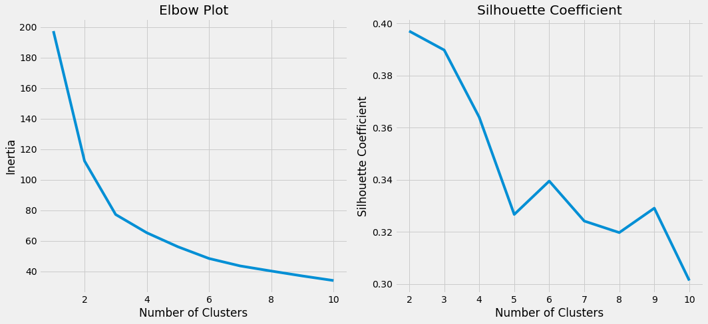


Before moving on to perform clustering analysis, we need to decide how many groups we're going to put our customers into, or technically referred as K. Charts above show that 3 is at the elbow area whose silhouette coefficient is high, therefore I select 3 as K value.


```python
#perform K-means Clustering
kmeans_1 = KMeans(n_jobs = -1, n_clusters = 3, init='k-means++',random_state=42)
kmeans_1.fit(df_clust)
```


    KMeans(algorithm='auto', copy_x=True, init='k-means++', max_iter=300,
        n_clusters=3, n_init=10, n_jobs=-1, precompute_distances='auto',
        random_state=42, tol=0.0001, verbose=0)


```python
#add K-means result to dataframe
df_result = df_rftv.copy()
df_result['cluster_ids'] = kmeans_1.labels_
df_result = df_result.reset_index()
```


```python
#showing profile of each cluster
print("Summary of each cluster")
summary = df_result.groupby('cluster_ids').describe().round(2).T.reset_index().rename(columns={'level_0': 'Metric','level_1' : 'Measure'})
summary = summary.set_index(['Metric', 'Measure'], append=False)
summary[summary.index.get_level_values('Measure').isin(['mean','min','max','25%','50%','75%'])]
```

    Summary of each cluster
    


<div>
<style scoped>
    .dataframe tbody tr th:only-of-type {
        vertical-align: middle;
    }

    .dataframe tbody tr th {
        vertical-align: top;
    }

    .dataframe thead th {
        text-align: right;
    }
</style>
<table border="1" class="dataframe">
  <thead>
    <tr style="text-align: right;">
      <th></th>
      <th>cluster_ids</th>
      <th>0</th>
      <th>1</th>
      <th>2</th>
    </tr>
    <tr>
      <th>Metric</th>
      <th>Measure</th>
      <th></th>
      <th></th>
      <th></th>
    </tr>
  </thead>
  <tbody>
    <tr>
      <th rowspan="6" valign="top">CLV</th>
      <th>mean</th>
      <td>12.98</td>
      <td>19.01</td>
      <td>4.31</td>
    </tr>
    <tr>
      <th>min</th>
      <td>1.12</td>
      <td>2.01</td>
      <td>0.34</td>
    </tr>
    <tr>
      <th>25%</th>
      <td>4.87</td>
      <td>5.09</td>
      <td>1.71</td>
    </tr>
    <tr>
      <th>50%</th>
      <td>8.09</td>
      <td>7.60</td>
      <td>2.86</td>
    </tr>
    <tr>
      <th>75%</th>
      <td>14.16</td>
      <td>14.56</td>
      <td>4.79</td>
    </tr>
    <tr>
      <th>max</th>
      <td>296.50</td>
      <td>356.00</td>
      <td>57.32</td>
    </tr>
    <tr>
      <th rowspan="6" valign="top">frequency</th>
      <th>mean</th>
      <td>1.05</td>
      <td>1.29</td>
      <td>1.07</td>
    </tr>
    <tr>
      <th>min</th>
      <td>1.00</td>
      <td>1.00</td>
      <td>1.00</td>
    </tr>
    <tr>
      <th>25%</th>
      <td>1.00</td>
      <td>1.00</td>
      <td>1.00</td>
    </tr>
    <tr>
      <th>50%</th>
      <td>1.00</td>
      <td>1.00</td>
      <td>1.00</td>
    </tr>
    <tr>
      <th>75%</th>
      <td>1.00</td>
      <td>1.00</td>
      <td>1.00</td>
    </tr>
    <tr>
      <th>max</th>
      <td>6.00</td>
      <td>14.00</td>
      <td>5.00</td>
    </tr>
    <tr>
      <th rowspan="6" valign="top">recency</th>
      <th>mean</th>
      <td>61.33</td>
      <td>312.19</td>
      <td>81.78</td>
    </tr>
    <tr>
      <th>min</th>
      <td>1.00</td>
      <td>186.00</td>
      <td>1.00</td>
    </tr>
    <tr>
      <th>25%</th>
      <td>15.00</td>
      <td>245.00</td>
      <td>25.00</td>
    </tr>
    <tr>
      <th>50%</th>
      <td>45.00</td>
      <td>296.00</td>
      <td>69.00</td>
    </tr>
    <tr>
      <th>75%</th>
      <td>94.00</td>
      <td>355.50</td>
      <td>133.50</td>
    </tr>
    <tr>
      <th>max</th>
      <td>230.00</td>
      <td>633.00</td>
      <td>202.00</td>
    </tr>
    <tr>
      <th rowspan="6" valign="top">T</th>
      <th>mean</th>
      <td>178.93</td>
      <td>436.12</td>
      <td>420.01</td>
    </tr>
    <tr>
      <th>min</th>
      <td>7.00</td>
      <td>250.00</td>
      <td>297.00</td>
    </tr>
    <tr>
      <th>25%</th>
      <td>124.00</td>
      <td>364.25</td>
      <td>355.00</td>
    </tr>
    <tr>
      <th>50%</th>
      <td>188.00</td>
      <td>435.50</td>
      <td>411.00</td>
    </tr>
    <tr>
      <th>75%</th>
      <td>237.00</td>
      <td>499.50</td>
      <td>475.00</td>
    </tr>
    <tr>
      <th>max</th>
      <td>299.00</td>
      <td>695.00</td>
      <td>692.00</td>
    </tr>
    <tr>
      <th rowspan="6" valign="top">monetary_value</th>
      <th>mean</th>
      <td>158.26</td>
      <td>150.15</td>
      <td>141.88</td>
    </tr>
    <tr>
      <th>min</th>
      <td>11.56</td>
      <td>15.89</td>
      <td>14.08</td>
    </tr>
    <tr>
      <th>25%</th>
      <td>61.55</td>
      <td>66.73</td>
      <td>62.00</td>
    </tr>
    <tr>
      <th>50%</th>
      <td>110.64</td>
      <td>109.26</td>
      <td>104.28</td>
    </tr>
    <tr>
      <th>75%</th>
      <td>182.56</td>
      <td>175.57</td>
      <td>171.62</td>
    </tr>
    <tr>
      <th>max</th>
      <td>2,405.28</td>
      <td>1,223.06</td>
      <td>1,391.79</td>
    </tr>
    <tr>
      <th rowspan="6" valign="top">predict_purch_10</th>
      <th>mean</th>
      <td>0.00</td>
      <td>0.01</td>
      <td>0.00</td>
    </tr>
    <tr>
      <th>min</th>
      <td>0.00</td>
      <td>0.00</td>
      <td>0.00</td>
    </tr>
    <tr>
      <th>25%</th>
      <td>0.00</td>
      <td>0.00</td>
      <td>0.00</td>
    </tr>
    <tr>
      <th>50%</th>
      <td>0.00</td>
      <td>0.00</td>
      <td>0.00</td>
    </tr>
    <tr>
      <th>75%</th>
      <td>0.01</td>
      <td>0.00</td>
      <td>0.00</td>
    </tr>
    <tr>
      <th>max</th>
      <td>0.06</td>
      <td>0.23</td>
      <td>0.01</td>
    </tr>
    <tr>
      <th rowspan="6" valign="top">predict_purch_30</th>
      <th>mean</th>
      <td>0.01</td>
      <td>0.02</td>
      <td>0.00</td>
    </tr>
    <tr>
      <th>min</th>
      <td>0.00</td>
      <td>0.00</td>
      <td>0.00</td>
    </tr>
    <tr>
      <th>25%</th>
      <td>0.01</td>
      <td>0.01</td>
      <td>0.00</td>
    </tr>
    <tr>
      <th>50%</th>
      <td>0.01</td>
      <td>0.01</td>
      <td>0.00</td>
    </tr>
    <tr>
      <th>75%</th>
      <td>0.02</td>
      <td>0.01</td>
      <td>0.00</td>
    </tr>
    <tr>
      <th>max</th>
      <td>0.16</td>
      <td>0.67</td>
      <td>0.04</td>
    </tr>
    <tr>
      <th rowspan="6" valign="top">predict_purch_60</th>
      <th>mean</th>
      <td>0.02</td>
      <td>0.03</td>
      <td>0.01</td>
    </tr>
    <tr>
      <th>min</th>
      <td>0.00</td>
      <td>0.01</td>
      <td>0.00</td>
    </tr>
    <tr>
      <th>25%</th>
      <td>0.01</td>
      <td>0.01</td>
      <td>0.00</td>
    </tr>
    <tr>
      <th>50%</th>
      <td>0.02</td>
      <td>0.01</td>
      <td>0.01</td>
    </tr>
    <tr>
      <th>75%</th>
      <td>0.03</td>
      <td>0.02</td>
      <td>0.01</td>
    </tr>
    <tr>
      <th>max</th>
      <td>0.28</td>
      <td>1.27</td>
      <td>0.07</td>
    </tr>
    <tr>
      <th rowspan="6" valign="top">predict_purch_90</th>
      <th>mean</th>
      <td>0.03</td>
      <td>0.04</td>
      <td>0.01</td>
    </tr>
    <tr>
      <th>min</th>
      <td>0.01</td>
      <td>0.01</td>
      <td>0.00</td>
    </tr>
    <tr>
      <th>25%</th>
      <td>0.02</td>
      <td>0.02</td>
      <td>0.01</td>
    </tr>
    <tr>
      <th>50%</th>
      <td>0.03</td>
      <td>0.02</td>
      <td>0.01</td>
    </tr>
    <tr>
      <th>75%</th>
      <td>0.04</td>
      <td>0.03</td>
      <td>0.01</td>
    </tr>
    <tr>
      <th>max</th>
      <td>0.38</td>
      <td>1.82</td>
      <td>0.10</td>
    </tr>
    <tr>
      <th rowspan="6" valign="top">prob_alive</th>
      <th>mean</th>
      <td>0.09</td>
      <td>0.15</td>
      <td>0.05</td>
    </tr>
    <tr>
      <th>min</th>
      <td>0.02</td>
      <td>0.07</td>
      <td>0.01</td>
    </tr>
    <tr>
      <th>25%</th>
      <td>0.06</td>
      <td>0.11</td>
      <td>0.03</td>
    </tr>
    <tr>
      <th>50%</th>
      <td>0.09</td>
      <td>0.12</td>
      <td>0.05</td>
    </tr>
    <tr>
      <th>75%</th>
      <td>0.11</td>
      <td>0.14</td>
      <td>0.07</td>
    </tr>
    <tr>
      <th>max</th>
      <td>0.41</td>
      <td>0.84</td>
      <td>0.18</td>
    </tr>
  </tbody>
</table>
</div>


```python
fig, axes = plt.subplots(nrows=3, ncols=2, figsize=(15, 15))

sns.boxplot(y="CLV", x= "cluster_ids", data=df_result,  hue='cluster_ids' , ax=axes[0,0]).get_legend().remove()
sns.boxplot(y="recency", x= "cluster_ids", data=df_result,  hue='cluster_ids' , ax=axes[0,1]).get_legend().remove()
sns.boxplot(y="frequency", x= "cluster_ids", data=df_result,  hue='cluster_ids' , ax=axes[1,0]).get_legend().remove()
sns.boxplot(y="T", x= "cluster_ids", data=df_result,  hue='cluster_ids' , ax=axes[1,1]).get_legend().remove()
sns.boxplot(y="monetary_value", x= "cluster_ids", data=df_result,  hue='cluster_ids' , ax=axes[2,0]).get_legend().remove()
sns.boxplot(y="prob_alive", x= "cluster_ids", data=df_result,  hue='cluster_ids' , ax=axes[2,1]).get_legend().remove()
axes[0,0].set_yscale('log')
axes[0,1].set_yscale('log')
axes[2,0].set_yscale('log')
axes[2,1].set_yscale('log')
axes[0,0].set(title='Customer Lifetime Value(CLV)', xlabel='', ylabel='CLV(logged)')
axes[0,1].set(title='Recency', xlabel='', ylabel='Recency(logged)')
axes[1,0].set(title='Frequency', xlabel='', ylabel='Frequency')
axes[1,1].set(title='Customer Age/Tenure(T)', xlabel='', ylabel='Tenure(T)')
axes[2,0].set(title='Monetary Value', xlabel='Cluster Id', ylabel='Monetary Value(logged)')
axes[2,1].set(title='Alive(Not Churned) Probability', xlabel='Cluster Id', ylabel='Alive Probability(logged)');
```


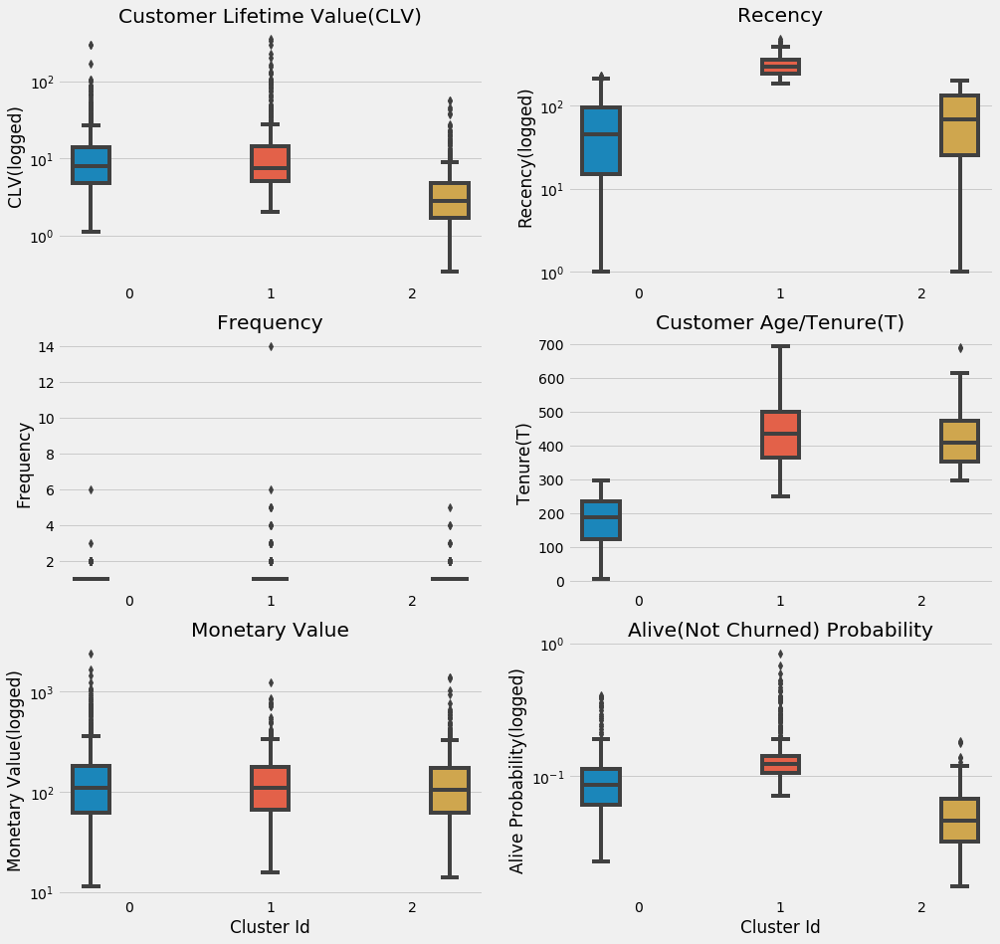


K-Means Clustering assigns customers into three clusters/groups, here's their profile:
- Cluster 0, fresh and fierce: relatively new customers(approx. 1 year) and recently buy something from Olist, but they are willing to spend more than the other groups.
- Cluster 1, old but gold: the oldest yet the most alive group that haven't bought anything for roughly a year, although, expect one or two purchases with high value from them over the next two or three months
- Cluster 2, the middle child: the second oldest and the least in all aspects but they make more than one purchase in a relatively short period of time. BG/NBD sees a potential in this group, maybe all they need is a little push

# Go Back To Transaction

With the list of most profitable customers in our pocket, let's see what top 10 product categories they like to buy often. 


```python
order_item_product = pd.merge(pd.merge(pd.merge(pd.merge(pd.merge(order_items,orders,how = "left"),products,how = "left"),customers,how = "left"),df_result,how = "left"),product_category_name_translation,how = "left")
order_item_product = order_item_product[order_item_product['cluster_ids'].notnull()]
order_item_product['cluster_ids']=order_item_product['cluster_ids'].astype(float).astype(int).astype(str)
```


```python
rank_product_cnt = order_item_product.groupby(['cluster_ids','product_category_name_english'])['product_id'].count().reset_index(name = 'count').sort_values(by =["cluster_ids","count"], ascending=False)
rank_product_cnt = rank_product_cnt.groupby(['cluster_ids']).head(10)

fig, axes = plt.subplots(nrows=1, ncols=3, figsize=(18, 8),sharex=True)
sns.barplot(y="product_category_name_english", x= "count", data=rank_product_cnt[rank_product_cnt['cluster_ids']=='0'], color='dodgerblue', ax=axes[0])
sns.barplot(y="product_category_name_english", x= "count", data=rank_product_cnt[rank_product_cnt['cluster_ids']=='1'],  color='r' , ax=axes[1])
sns.barplot(y="product_category_name_english", x= "count", data=rank_product_cnt[rank_product_cnt['cluster_ids']=='2'],  color='goldenrod' , ax=axes[2])
axes[0].set(title='Cluster 0', xlabel='Qty', ylabel='Product Category')
axes[1].set(title='Cluster 1', xlabel='Qty', ylabel='Product Category')
axes[2].set(title='Cluster 2', xlabel='Qty', ylabel='Product Category')
fig.tight_layout();
```


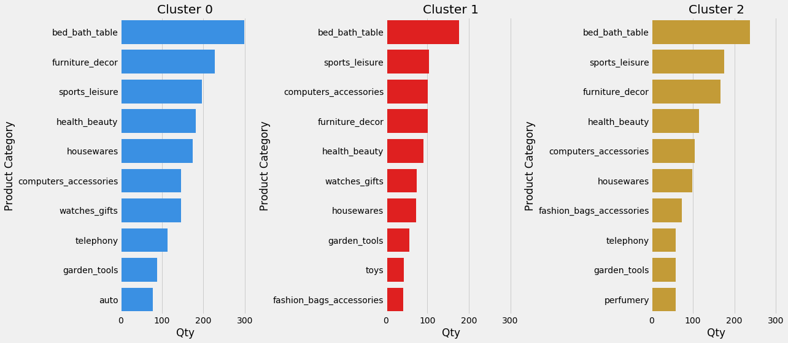


Next, the top 10 items they spend their money on


```python
rank_product_sum = order_item_product.groupby(['cluster_ids','product_category_name_english'])['price'].sum().reset_index(name = 'count').sort_values(by =["cluster_ids","count"], ascending=False)
rank_product_sum = rank_product_sum.groupby(['cluster_ids']).head(10)

fig, axes = plt.subplots(nrows=1, ncols=3, figsize=(18, 8),sharex=True)
sns.barplot(y="product_category_name_english", x= "count", data=rank_product_sum[rank_product_sum['cluster_ids']=='0'], color='dodgerblue', ax=axes[0])
sns.barplot(y="product_category_name_english", x= "count", data=rank_product_sum[rank_product_sum['cluster_ids']=='1'],  color='r' , ax=axes[1])
sns.barplot(y="product_category_name_english", x= "count", data=rank_product_sum[rank_product_sum['cluster_ids']=='2'],  color='goldenrod' , ax=axes[2])
axes[0].set(title='Cluster 0', xlabel='Total Purchase', ylabel='Product Category')
axes[1].set(title='Cluster 1', xlabel='Total Purchase', ylabel='Product Category')
axes[2].set(title='Cluster 2', xlabel='Total Purchase', ylabel='Product Category')
fig.tight_layout();
```


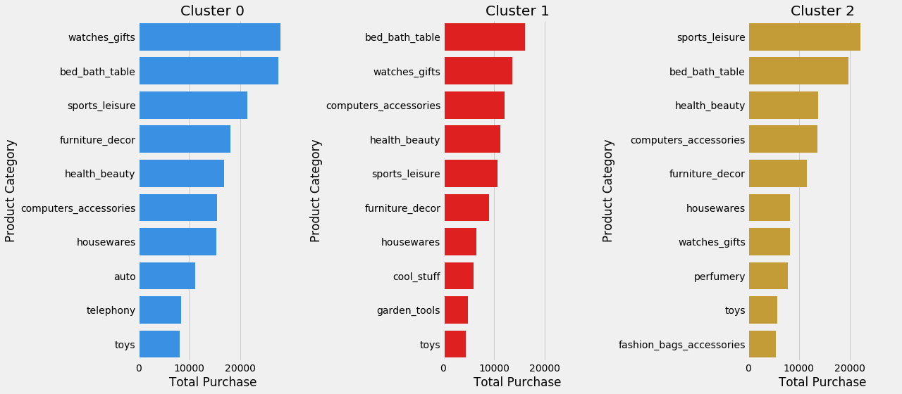


# Last But Not Least...

After the long process, we end up with the list of best customers. Although the dataset is limited, BG/NBD and Gamma-Gamma model produce a quite good result and help us understand more about the customers. This insight potentially could be used by Olist to stategically gain merchants whose products cater to the profitable customers and by merchants to level up their marketing strategies.
